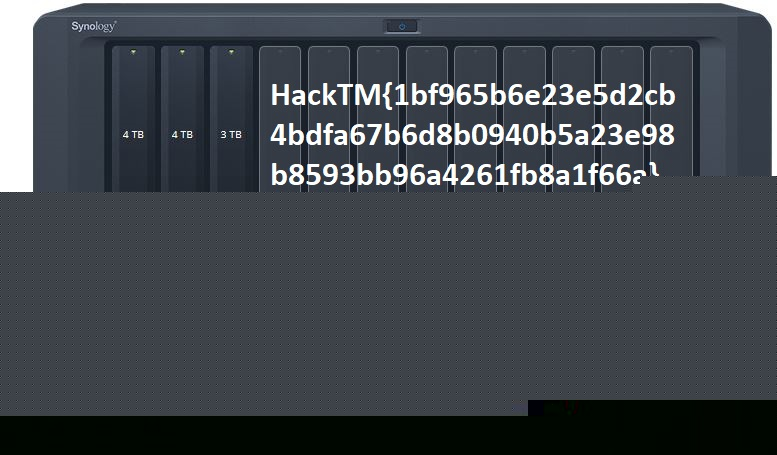

# RR (for, 298p, 67 solved)

In this challenge we get a RAID-5 images, with 2 valid and 1 broken image.
Since it's RAID-5 we can recover the missing parts of the data, because for given block the drive either contains real data, or XOR of data from two other drives.

This means that we can XOR the two images we have, and then rebuild the disk from those 3 images.
We just used the tool `OSForensics` for the RAID rebuilding.

We only had to guess the size of the block, but this we can estimate by looking at the consecutive data blocks in the images we have.
There were some long text-files on the disk, and they were a good target.
We can find some long text block and then lots of nullbytes, and this tells us the size is 65536 bytes.

With this we can rebuild the full disk image.

In the disk we can find that there is `Flag.jpg` somewhere there.
We can use binwalk, or just carve it out with hexeditor looking for `JFIF` magic:

Then we need to re-type a very long flag: `HackTM{1bf965b6e23e5d2cb4bdfa67b6d8b0940b5a23e98b8593bb96a4261fb8a1f66a}`
