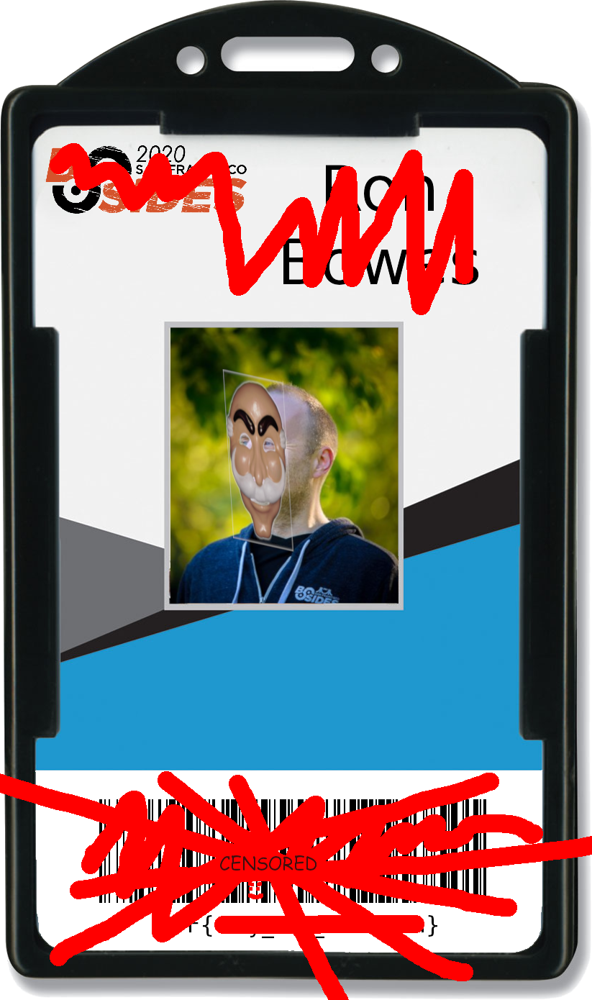
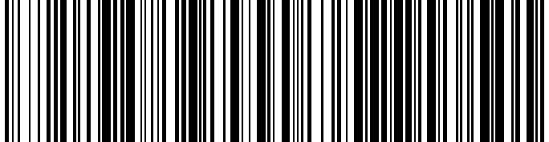

# barcoder (forensics/101, 51p, 37 solved)

Zero technicall challenge here, just tedious manual work.
We get a picture:

The goal is to recover the barcode and decode it.
There is nothing special really, we cut out the barcode, used stegsolve to get just one color channel to get rid of all the surroudings, and then simply painted back the missing lines.
For each line there is at least a fraction left, so it's always clear how thick to make it.
Finally we arrive to:

And ZXing gives us the flag: `CTF{way_too_common}`
