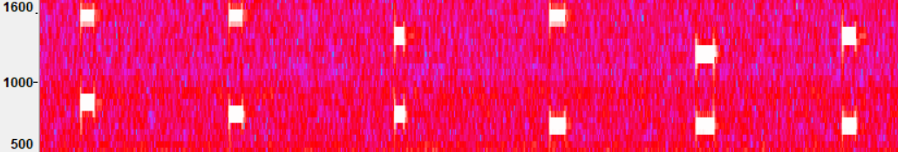

# Eavesdropper (forensics, 108p, 20 solved)

In the challenge we get a [wav recording](eavesdropper.wav) of a phonecall where someone uses dial-tones to input secret code.
It's rather classic forensics challenge, so we simply load the file into Audacity, and run DTMF decoder plugin.
Interestingly the decoder had some issues with properly figuring out the length of the signal, outputting multiple values instead of one, but we can simply select one digit at a time.

If someone is interested in doing this `the hard way` it's also pretty simple.
We can display the wav in Audacity as `spectrogram` and select the frequency ranges to match DTMF codes and we can see:

Either way we can easily read the code: `665645`

Now we just need to call the given number, go bankrupt on international calls and get the flag `ctf{dtmf_is_awesome}`
