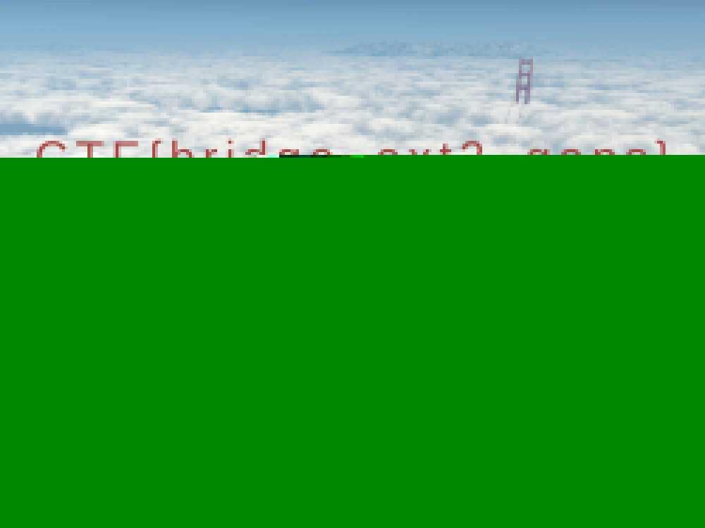

# Mpfrag (forensics, 423p, 7 solved)

A rather confusing forensics task.
I'm under the impression we solved this somehow not the intended way...

We get a file `disk.bin: Linux rev 1.0 ext2 filesystem data, UUID=07a34ef3-2282-447d-b2fd-1ade0b320153 (large files)`

By running binwalk on this we get an [encrypted zip](test.zip) which contains file `cloud_flag.jpg`.
Seems like a good starting point.

The challenge name and description says something about MPEG so we looked for mpg markers in the given disk image, and there were some, so we carved this out with hexeditor and got a [video](test.mpg).

The video clearly shows a password of some kind: `SF-G0lden-Gl0w-1848`.
And this password actually works almost fine for the ZIP.

There are some errors but we managed to get the [output jpg](cloud_flag.jpg).
The file seems to be broken somehow (perhaps the zip was not carved properly?) but we managed to open it anyway in some fancy image software. 

It was only displaying the top half of the flag:  

With our unprecedented guessing skills we managed to figure out the flag: `CTF{bridge_ext2_gaps}`

