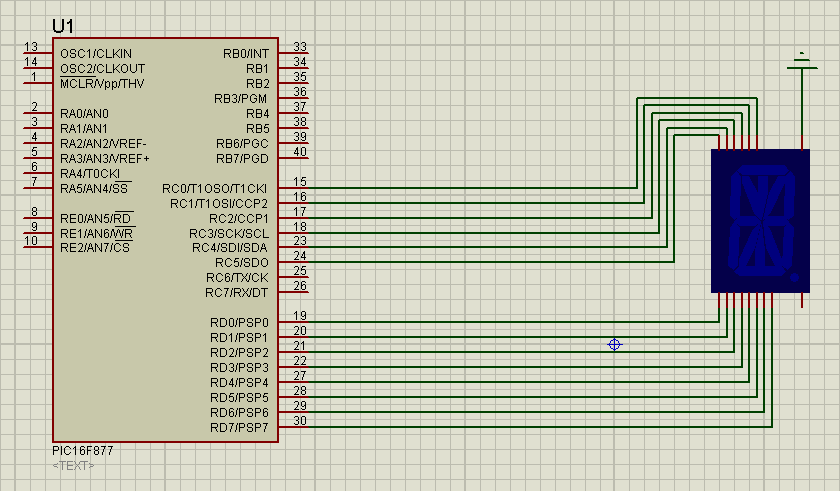

# Mental adventure: beginning (warmup/PIC, 232p, 42 solved)

In the challenge we get a [hex file](Beginning.HEX) and a schematic:



From the picture we can read the chip name, and thanks to that we can load it into ghidra and specify the architecture to PIC16fF.

There is not much code there really.
Main function is:


```c
  DAT_DATA_0024 = param_1;
  while( true ) {
    DAT_DATA_0020 = FUN_CODE_0f00(DAT_DATA_0024);
    DAT_DATA_0025 = DAT_DATA_0020;
    FUN_CODE_0016();
    FUN_CODE_000e();
    if (DAT_DATA_0025 == '\0') break;
    DAT_DATA_0024 = DAT_DATA_0024 + '\x01';
  }
  return DAT_DATA_0025;
```

`param_1` starts with `0` and this is just a simple while loop, looping until `FUN_CODE_0f00` does not return `0`, and incrementing the counter each time -> `DAT_DATA_0024 = DAT_DATA_0024 + '\x01'`

There are also functions `FUN_CODE_0016` and `FUN_CODE_000e`.
The latter seems to be some kind of active sleep, and the former we actually totally skipped during this challenge and got back to it only for the next one.
What it does, is translating the input value into 14-segment display control code, but we don't really need to know that here.

Going back to `FUN_CODE_0f00`, this function is:

```asm
                     //
                     // CODE 
                     // Generated by Intel Hex
                     // CODE: CODE:0f00-CODE:0f1d.1
                     //
                     *************************************************************
                     *                           FUNCTION                          
                     *************************************************************
                     undefined  FUN_CODE_0f00 ()
                       assume PCLATH = 0xf
     undefined         W:1            <RETURN>
                     FUN_CODE_0f00                                   XREF[1]:     FUN_CODE_0176:017a (c)   
CODE:0f00 82  07           ADDWF      PC,f
                     LAB_CODE_0f01                                   XREF[1]:     CODE:0f00 (j)   
CODE:0f01 0a  34           RETLW      #0xa
                     LAB_CODE_0f02                                   XREF[1]:     CODE:0f00 (j)   
CODE:0f02 0e  34           RETLW      #0xe
                     LAB_CODE_0f03                                   XREF[1]:     CODE:0f00 (j)   
CODE:0f03 1b  34           RETLW      #0x1b
                     LAB_CODE_0f04                                   XREF[1]:     CODE:0f00 (j)   
CODE:0f04 18  34           RETLW      #0x18
                     LAB_CODE_0f05                                   XREF[1]:     CODE:0f00 (j)   
CODE:0f05 24  34           RETLW      #0x24
                     LAB_CODE_0f06                                   XREF[1]:     CODE:0f00 (j)   
CODE:0f06 19  34           RETLW      #0x19
                     LAB_CODE_0f07                                   XREF[1]:     CODE:0f00 (j)   
CODE:0f07 12  34           RETLW      #0x12
                     LAB_CODE_0f08                                   XREF[1]:     CODE:0f00 (j)   
CODE:0f08 0c  34           RETLW      #0xc
                     LAB_CODE_0f09                                   XREF[1]:     CODE:0f00 (j)   
CODE:0f09 26  34           RETLW      #0x26
                     LAB_CODE_0f0a                                   XREF[1]:     CODE:0f00 (j)   
CODE:0f0a 12  34           RETLW      #0x12
                     LAB_CODE_0f0b                                   XREF[1]:     CODE:0f00 (j)   
CODE:0f0b 1c  34           RETLW      #0x1c
                     LAB_CODE_0f0c                                   XREF[1]:     CODE:0f00 (j)   
CODE:0f0c 26  34           RETLW      #0x26
                     LAB_CODE_0f0d                                   XREF[1]:     CODE:0f00 (j)   
CODE:0f0d 1c  34           RETLW      #0x1c
                     LAB_CODE_0f0e                                   XREF[1]:     CODE:0f00 (j)   
CODE:0f0e 12  34           RETLW      #0x12
                     LAB_CODE_0f0f                                   XREF[1]:     CODE:0f00 (j)   
CODE:0f0f 16  34           RETLW      #0x16
                     LAB_CODE_0f10                                   XREF[1]:     CODE:0f00 (j)   
CODE:0f10 19  34           RETLW      #0x19
                     LAB_CODE_0f11                                   XREF[1]:     CODE:0f00 (j)   
CODE:0f11 15  34           RETLW      #0x15
                     LAB_CODE_0f12                                   XREF[1]:     CODE:0f00 (j)   
CODE:0f12 0e  34           RETLW      #0xe
                     LAB_CODE_0f13                                   XREF[1]:     CODE:0f00 (j)   
CODE:0f13 26  34           RETLW      #0x26
                     LAB_CODE_0f14                                   XREF[1]:     CODE:0f00 (j)   
CODE:0f14 1a  34           RETLW      #0x1a
                     LAB_CODE_0f15                                   XREF[1]:     CODE:0f00 (j)   
CODE:0f15 04  34           RETLW      #0x4
                     LAB_CODE_0f16                                   XREF[1]:     CODE:0f00 (j)   
CODE:0f16 0a  34           RETLW      #0xa
                     LAB_CODE_0f17                                   XREF[1]:     CODE:0f00 (j)   
CODE:0f17 08  34           RETLW      #0x8
                     LAB_CODE_0f18                                   XREF[1]:     CODE:0f00 (j)   
CODE:0f18 14  34           RETLW      #0x14
                     LAB_CODE_0f19                                   XREF[1]:     CODE:0f00 (j)   
CODE:0f19 01  34           RETLW      #0x1
                     LAB_CODE_0f1a                                   XREF[1]:     CODE:0f00 (j)   
CODE:0f1a 15  34           RETLW      #0x15
                     LAB_CODE_0f1b                                   XREF[1]:     CODE:0f00 (j)   
CODE:0f1b 07  34           RETLW      #0x7
                     LAB_CODE_0f1c                                   XREF[1]:     CODE:0f00 (j)   
CODE:0f1c 25  34           RETLW      #0x25
                     LAB_CODE_0f1d                                   XREF[1]:     CODE:0f00 (j)   
CODE:0f1d 00  34           RETLW      #0x0
```

So it just jumps `k` bytes forward (where `k` is the parameter), and each instruction it an hit is just a return with some value.
This means it's a simple mapping `x->y`.

We know that input for this functio is just consecutive numbers starting at 0, and we can see that it will return `0` for `0x1d` and this will break the main loop.
We can therefore just generate the output sequence of this function, but grepping the `#0x` values:

```python
['0xa', '0xe', '0x1b', '0x18', '0x24', '0x19', '0x12', '0xc', '0x26', '0x12', '0x1c', '0x26', '0x1c', '0x12', '0x16', '0x19', '0x15', '0xe', '0x26', '0x1a', '0x4', '0xa', '0x8', '0x14', '0x1', '0x15', '0x7', '0x25', '0x0']
```

Now maybe we could have figured out that the `FUN_CODE_0016` maps this into 14-segment display, but instead we noticed that the values here start with `0xa 0xe` -> `ae`, looking like flag prefix!

Sadly the first attempt at converting this directly into ASCII failed:

```python
print("".join([chr(int(byte, 16)-0xa+ord('A')) for byte in data]))
```

But it gave us almost a flag `AERO[PIC]IS]SIMPLE]Q;A?K8L>\7`.

Clearly the idea is sound, just some detail is wrong.
After a while we figured that maybe it's not ASCII mapping, but something else, and we guessed instead `mapping = "0123456789ABCDEFGHIJKLMNOPQRSTUVWXYZ{}_"`.

Now applying this mapping:

```python
mapping = "0123456789ABCDEFGHIJKLMNOPQRSTUVWXYZ{}_"
print("".join([mapping[(int(byte, 16))] for byte in data]))
```

Gave us `AERO{PIC_IS_SIMPLE_Q4A8K1L7}0`
