# DotNetMe - VolgaCTF CTF 2020 (Reverse, 250p, 34 solved)

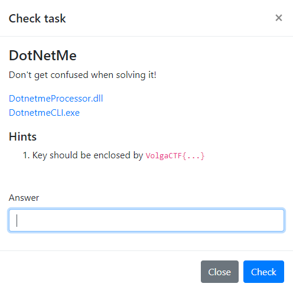

## Introduction

DotNetMe is obviously a Windows reverse task.

Two binaries are provided:

- A PE32+ executable file (console)
- Another PE32+ DLL

Both binary are .NET binaries are expected and are heavily obfuscated.

## Technical details

At first, we could see that both of the binaries are obfuscated and hard to read:

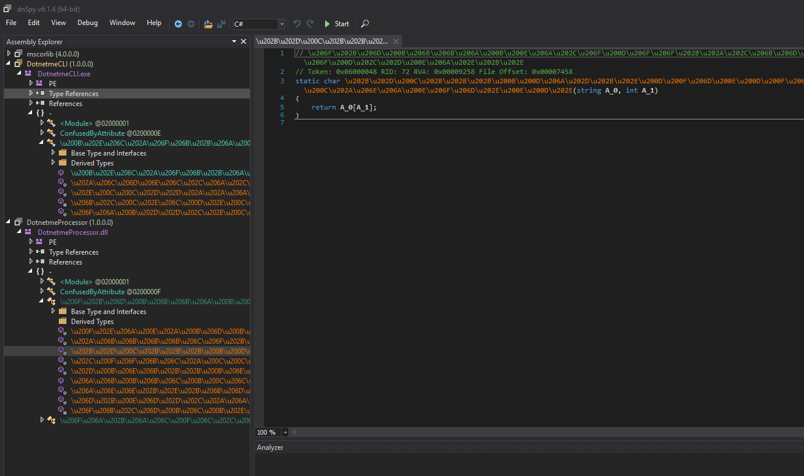

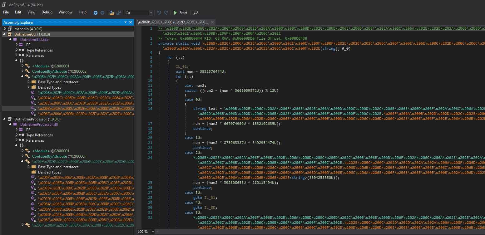

In fact, the symbol names are displayed in some kind of Unicode and all the logic is behind a "state machine". Each code scope is executed depending on the value of a global 32-bit integer.

The first thing I did to avoid burning my eyes was to run **de4dot** ([https://github.com/0xd4d/de4dot](https://github.com/0xd4d/de4dot)) against the two binary. This tool is helping us have simple method names like method_1, method_2, etc.

So we just drag and drop the two binaries on the `de4dot.exe` executable file and our two binaries get cleaned:

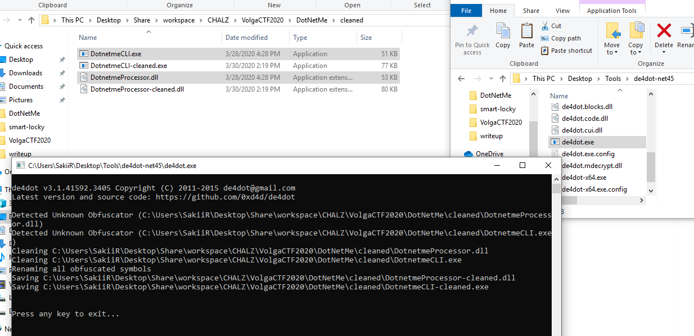

Now, let's import these into dnSpy ([https://github.com/0xd4d/dnSpy](https://github.com/0xd4d/dnSpy) **OpenSource .NET debugger and assembly editor**):

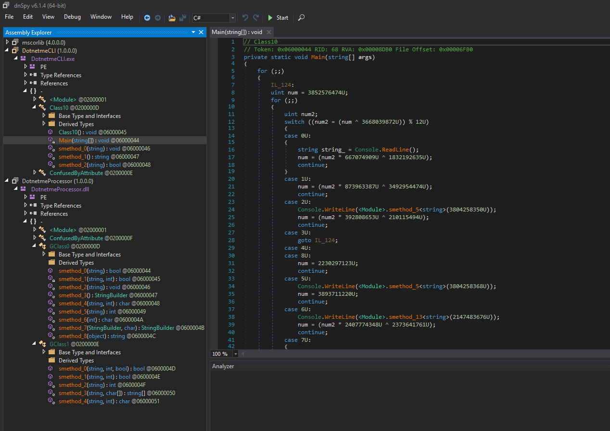

dnSpy is a cool tool that allows us to put breakpoint and see scoped local variables. Unfortunately, in this case, for some reason (Antidebugger tricks I guess), we could not see any locals ("Internal debugger error"):

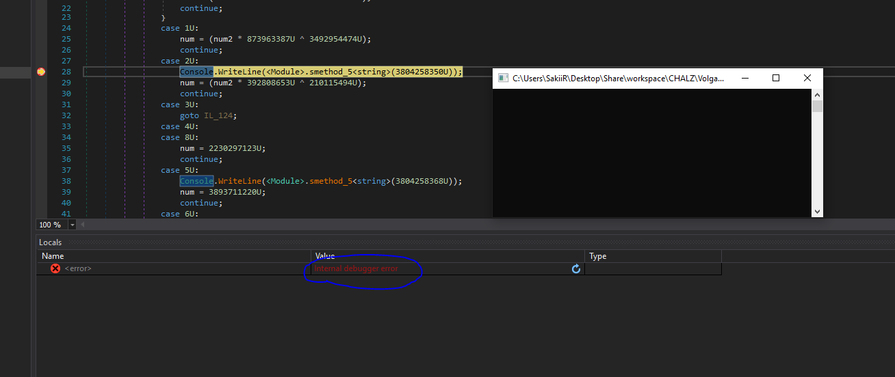

You can see line 28 that the program is displaying some text on the screen. The function returning the string to display is highly obfuscated and might be hard to reverse. Here, the text returned is displayed to the screen, so we just need to step over to see which string is returned.

The Main() method of the first binary is just looping infinitely and wait for a "flag" to be sent:

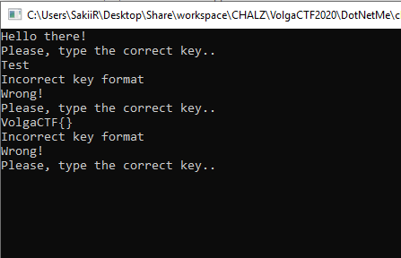

We can see that the interesting method called from main is located in the provided DLL:

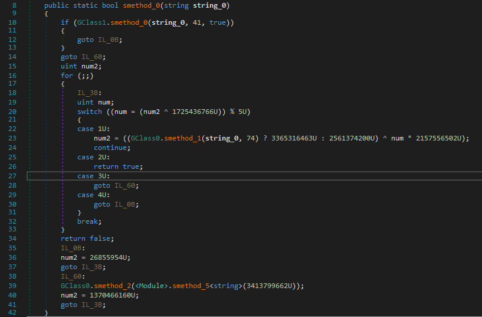

Since we can't debug anything here, I decided to rewrite the code into **Visual Studio** so that we can debug the whole binary without any issue.

This way, a lot of variables and functions could be renamed and while debugging, all the scope variables can be read:

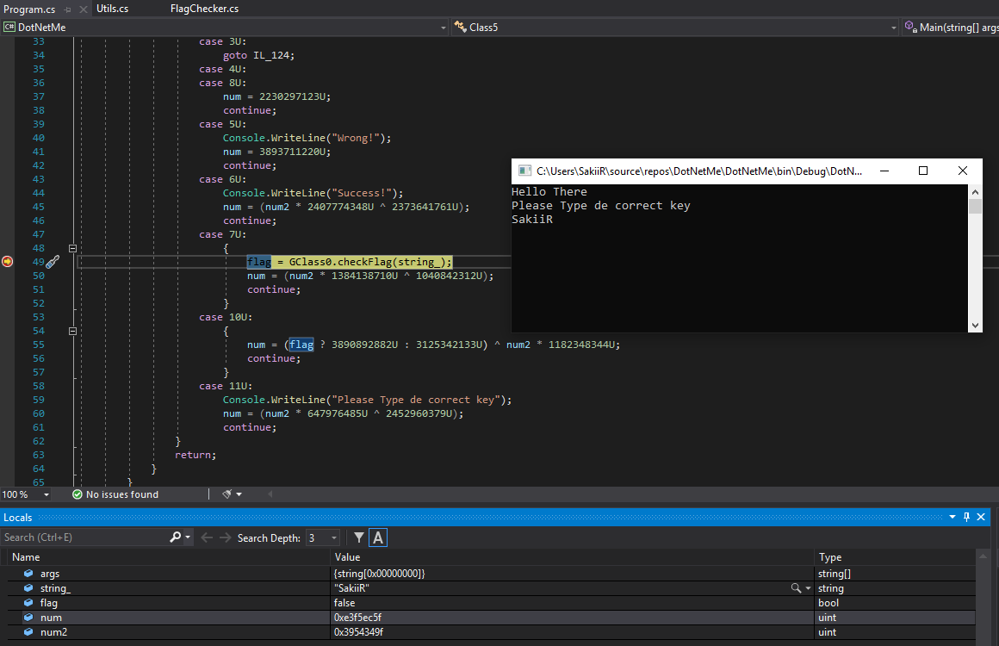

I went further and saw that the key has to respect a specific format (num variable represent the state of the function - Branching condition):

> Six '-' separated blocks

```csharp
num = (((GClass1.StringSplit(user_input, new char[]
{
'-'
}).Length == 6) ? 683502988U : 1473095498U) ^ num2 * 1113113859U);
```

> Each block has to contain 4 characters

```csharp
num = (GClass1.StringLength(input_parts[num3]) == 4) ? 161800768U : 267634710U;
```

> The whole flag has to be 29 characters long

```csharp
num = (((GClass1.StringLength(user_input) != 29) ? 650567720U : 925404683U) ^ num2 * 2388823709U);
```

> Finally, all of these characters have to be between 0x20 and 0x7f

```csharp
case 9U:
{
	num = ((c < '\u007f') ? 3945937441U : 3956362675U) ^ num2 * 3337894887U;
	continue;
}
case 10U:
{
	num = (((c < ' ') ? 2328726507U : 3166744977U) ^ num2 * 414064944U);
	continue;
}
```

From these conditions we can build a simple flag:

```
abcd-efgh-ijkl-mnop-qrst-uvwx
```

Another function is checking for "integrity". In fact, this function that we called `computeHash` will hash all the characters and then check for the returned value to be equal to the second parameter:

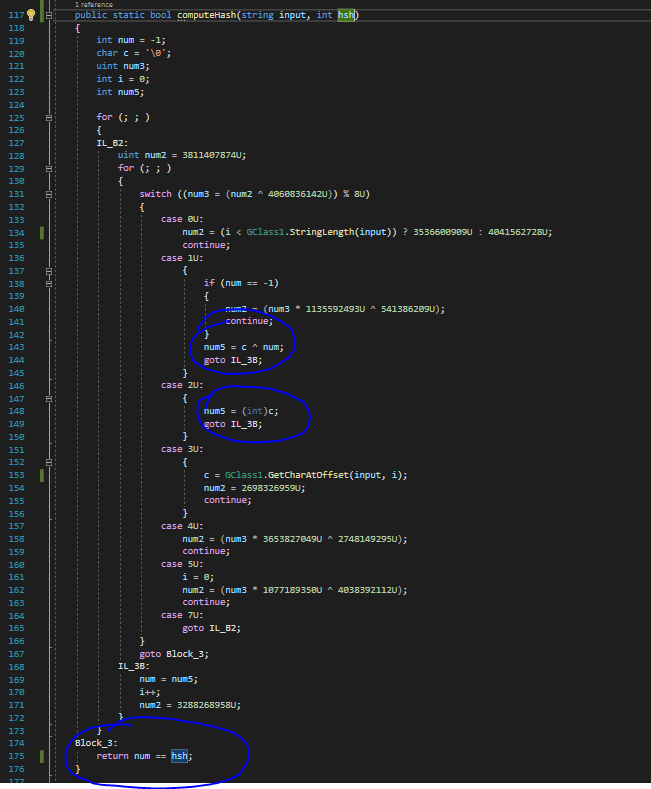

We can build a simple python function from this C# code:

```python
def computeHash(flag):
    i = 0
    ret = ord(flag[0])
    while i < len(flag) - 1:
        ret = ord(flag[i + 1]) ^ ret
        i += 1
    return ret

# computeHash('abcd-efgh-ijkl-mnop-qrst-uvwx')
```

In this case, the hash is computed and then compared to 41:


To match the first condition and go further we can simply replace the last 'x' with a 'd'. The message "Invalid flag format" will disappear:

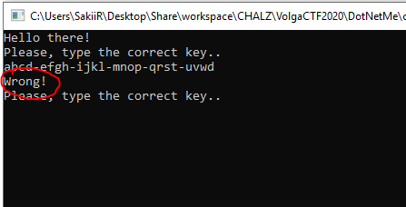

Let's go further, a last operation is performed on our user input with an unknown string. At the end of this function, a check is done on the flag (the same with computeHash), but this time, checked against '74' and with the third parameter to **false** (this boolean make the function check or not check the input format: 0x20 > c < 0x7f, etc.).

In this capture, we can see that the string used "key" is still unknown (because of the heavily obfuscated function returning string from int):

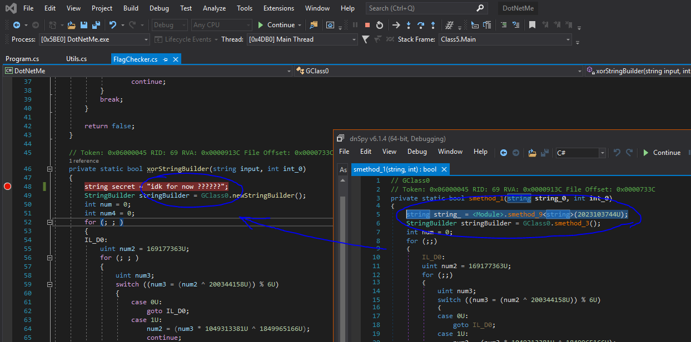

Earlier, we saw that string was retrieved through a "heavily obfuscated function.” Only one string remained unknown to me until I asked **XeR** to look into it. In fact, since the .NET standard library does not contain any antidebugger tricks, we could see all locals normally when going into it:

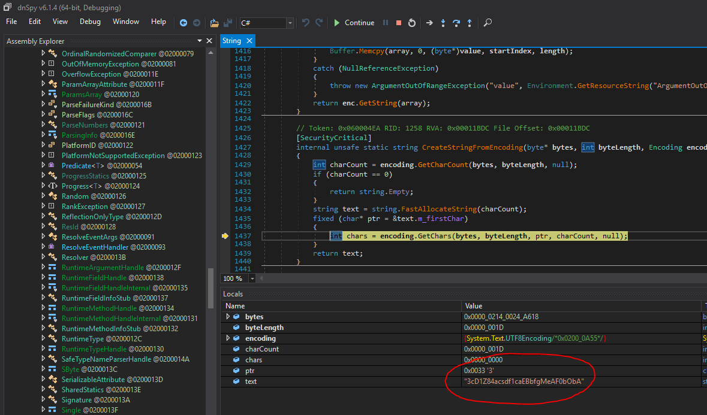

So we replaced the key, we go further with our special RE skills and write a python code from this cool function:

```python
def last_step(flag):
    out = ""
    for i, c in enumerate(flag):
        num4 = ord("*") * ord(c)

        a = (num4 >> 5) + (num4 >> 4) & 127
        b = num4 + ord(c) & 127
        c = ord(flag[len(flag) - 1 - i])

        out += chr(a ^ b ^ b)
    return out
```

> Here is the complete python script I made for the challenge "emulation"

```python
#!/usr/bin/env python
# @SakiiR

import sys

KEY = "3cD1Z84acsdf1caEBbfgMeAF0bObA"
SUM1 = 41
SUM2 = 74


def computeHash(flag):
    i = 0
    ret = ord(flag[0])
    while i < len(flag) - 1:
        ret = ord(flag[i + 1]) ^ ret
        i += 1
    return ret


def checkFormat(flag, hsh):
    if len(flag) != 29:
        print(f"Bad format: bad length {len(flag)}")
        return False
    if len(flag.split("-")) != 6:
        print(f"Bad format: count split {len(flag.split('-'))}")
        return False
    for c in flag:
        if ord(c) < 20 or ord(c) > 0x7F:
            print(f"Bad format: Bad chr '{c}'")
            return False
    hsh_check = computeHash(flag) == hsh
    if not hsh_check:
        print(f"Bad format: Bad checksum '{computeHash(flag)}' != {hsh}")

    return hsh_check


def last_step(flag):
    out = ""
    for i, c in enumerate(flag):
        num4 = ord("*") * ord(c)

        a = (num4 >> 5) + (num4 >> 4) & 127
        b = num4 + ord(c) & 127
        c = ord(flag[len(flag) - 1 - i])

        out += chr(a ^ b ^ b)
    return out


def main(argv):
    if len(argv) < 2:
        print(f"USAGE: {argv[0]} FLAG")
        return

    flag = argv[1]
    if not checkFormat(flag, SUM1):
        print(f"Bad Flag {flag}")
        return False

    hsh = computeHash(last_step(flag))
    if hsh != SUM2:
        print(f"Bad Flag {flag}: Invalid hash '{hsh}' != {SUM2}")
        return False

    print(f"Flag {flag} Ok !")


if __name__ == "__main__":
    main(sys.argv)
```

Note that later, there will be a check on the output of this function. The output's hash has to match the int "74". This is not very convenient since this is the second hash computed for the same output. We are going to need some z3 skills to solve these constraints.

Hopefully, **BitK** helped with that and provided us a cool script generating a valid key:

```python
from z3 import *


solver = Solver()

secret = b"3cD1Z84acsdf1caEBbfgMeAF0bObA"
key = [BitVec(f"input-{x}", 32) for x in range(29)]


def apply_format(arr):
    for c in arr:
        solver.add(c > 0x20)
        solver.add(c < 0x7F)

    for x in range(4, 29, 5):
        solver.add(arr[x] == ord("-"))


out = []
nums = []
for x in range(29):
    num4 = 42 * key[x]
    a = (LShR(num4, 6) + LShR(num4, 5)) & 127
    b = (num4 + secret[x]) & 127
    c = secret[28 - x]

    o = BitVec(f"out-{x}", 32)
    solver.add(o == (a ^ b ^ c))
    out.append(o)


def make_xor(arr):
    out = arr[0]
    for c in arr[1:]:
        out = out ^ c
    return out


solver.add(make_xor(key) == 41)
solver.add(make_xor(out) == 74)
apply_format(key)

if str(solver.check()) != "sat":
    exit(":(")

model = solver.model()

print("".join(chr(model[c].as_long()) for c in key))
```

The script outputs `!sfc-glZa-6|/z-~pNd-p3oK-kTss` which is valid against my script and the actual binary:

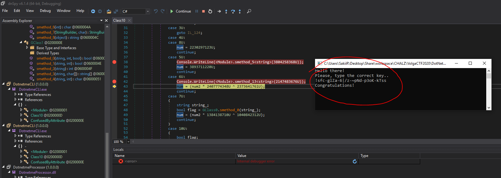

Also work as a flag: `VolgaCTF{!sfc-glZa-6|/z-~pNd-p3oK-kTss}`

```
 - @SakiiR

 Thanks to @BitK and @XeR
```
