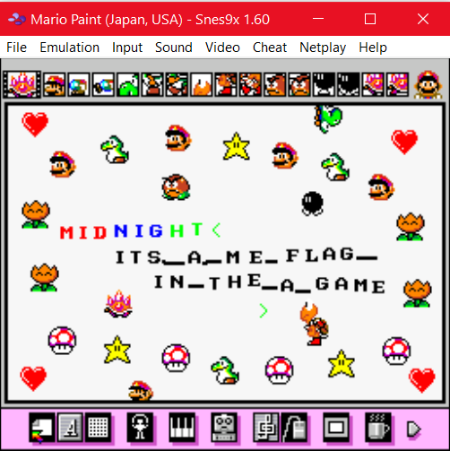

# Masterpiece (forensics, 78p, 115 solved)

In the challenge we get a Snes9x [state save file](masterpiece.000).
This is basically a saved state of the emulator.
If we ungzip this file and look at it with hexeditor we can extract some information about the game:

```
NAM:000065:Z:\Share\snes-forensics\snes9x\Roms\Mario Paint (Japan, USA).sfc
```

So we know the game, and we can easily find this ROM on the internet.
However just trying to load this file via `load game position` crashes/hangs the emulator.

If you look at the specs for the save state file eg. at https://github.com/snes9xgit/snes9x/blob/master/docs/snapshots.txt
you will see that the file has some clear structure with sections we can easily find by looking for certain strings.

Our first idea was to create a clean save state file for this game, and then transplant the memory and registers values from the broken save file, using hexeditor.

With this we got [this save file](Mario Paint (Japan, USA).000) which when loaded shows:



And the flag is: `midnight{ITS_A_ME_FLAG_IN_THE_A_GAME}`
