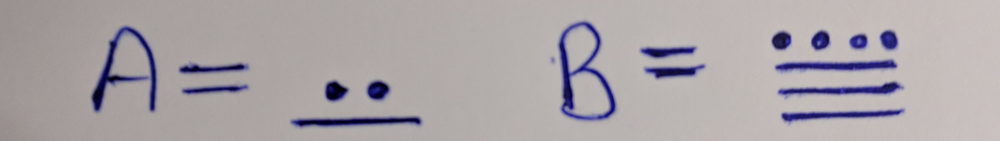

# Oldschool (crypto, 321p)

In this task we get two pieces of the flag encrypted in different ways.

## Part 1

For the first part we get some weird picture:

Which we didn't use at all.
We also get encrypted flag part and `hzdk{z_whg_mry_` some encrypted (by different method) hint `Wqv Lvf xp "hnovIvo"`.
The task mentions that this was encrypted using some "French" method, so we assume it's Vigenere.

Now we had no idea what is the picture and how the hint is encrypted, but just knowing that flag prefix is encrypted via Vigenere we can easily notice that `hzdk` is `flag`.
From this we can immediately infer the key prefix -> `CODE`.
No we assumed that maybe the hint is encrypted via some monoalphabetic substitution, and also that the word in `"` is the keyword.
This means that `hnovIvo` is `CODE???`, but if it's monoalphabetic then repeated letters are encrypted the same way, so in fact we know that `hnovIvo` is `CODE?ED`!
We're now missing only one character, which we can brute-force/guess and we get the flag prefix `flag{i_see_you_`

## Part 2

In this part we get some encoded data: `=]e7A=>F&G@TRAe@9#X>=>OH3:,6Kp:,6I.=F*;T>"1M.;+PJ<Al1]S` and information that the data were encoded twice, and `average was `74.5`.
Since it's twice and average is `74.5` then sum is `149`.
We just looked at different `base` encodings with large enough numbers and `85+64` was a good match.
Once we decode the data as base85 we get `YXIzX2ZAbWlsaUByX3cxN2hfN2gzXzBsZF93QHkkfQ==` and decoded as base64 we have: `ar3_f@mili@r_w17h_7h3_0ld_w@y$}`

## Final

Now we just glue both parts: `flag{i_see_you_ar3_f@mili@r_w17h_7h3_0ld_w@y$}`
