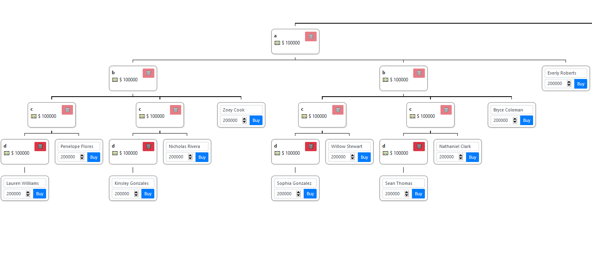

# Pwnzi 1 (web, 151+4p, 28 solved)

## Overview

In the task we get access to webpage, where we can invest money in some piramidal scheme.
In the profile page we can see that there are placeholders for 2 flags.
One is supposed to be visible only to admin, the other one can be purchased if we have enough `Expected Interest` from investments.

There are also perks for uploading files and reporting pages to admin, but this is relevant only for the second part of the task, so we can skip this here.

There are a couple of places in the html code and in robots which provide link to `pwnzi.jar` of this application.
We can download it, add as library in IntelliJ and go through the decompiled code.

## Getting money to buy perks

### Money hax

First idea is obviously to get enough money to buy perks.
There is a bug in the investment page, which you can accidentally spot easily enough, or figure out from the source code:

```java
Investment parent = (Investment)this.investments.findByOwnerAndName(user, rq.getParentName()).orElse((Object)null);
Investment newInvestment = (new Investment()).setOwner(user).setName(name).setDeposit(deposit);
user.setBalance(user.getBalance() - deposit);
this.investments.save(newInvestment);
if (parent != null) {
    parent.getChildren().add(newInvestment);
} else {
    user.getInvestments().add(newInvestment);
}
```

And 

```java
@ManyToMany(
    fetch = FetchType.LAZY
)
private List<Investment> children;
```

Children investments are a `List` and not `Set` so can contain duplicated entries.
This means we can invest into `A`, and then again into `A`, which is the same `A` but we have it twice.
Now if we invest into `B` as child of `A`, we will pay only once, but this `B` will be added to "every" `A` (technically there is only a single `A` but we have it many times on the children list).


### Perks hax

Now that we have lots of money it turns out we actually can't buy the flag perk :(

```java
@PostMapping({"/claim-perk"})
@Transactional
public ResponseEntity<String> claimPerk(@RequestParam("perk") int perk, HttpSession session) {
    if (perk < 0) {
        throw new PwnziException("value error");
    } else {
        User user = this.currentUser(session);
        if (user.hasPerk(perk)) {
            throw new PwnziException("perk already credited");
        } else if (perk == Perks.FLAG) {
            throw new PwnziException("sry, you have to work a bit harder for the flag");
        } else if (this.calculateExpectedInterest(user) < this.requiredInterestForPerk(perk)) {
            throw new PwnziException("need more expected interest for this perk");
        } else {
            user.addPerk(perk);
            return ResponseEntity.ok("perk credited");
        }
    }
}
```

`Perks` are:
```java
public class Perks {
    public static int UPLOAD_PHOTO = 1;
    public static int UPLOAD_ANYTHING = 13;
    public static int FLAG = 14;

    public Perks() {
    }
}
```

But notice that for any other value, the code just goes to `user.addPerk(perk);`
If we look into this method we see:

```java
    public void addPerk(int perk) {
        this.perks = (short)(this.perks | 1 << perk);
```

This is interesting, because sending `14` will have exactly the same effect as sending `14+k*32`, so instead of perk 14 we can send request to buy 46 to get the flag.

Now we actually need A LOT of money, but it's possible with chain (all with minimum investment):

- 3xA on first level `3*1.12 return`
- 2xB as child of A on second level `3*2*1.12**2 return`
- 2xC as child of B on third level `3*2*2*1.12**3 return`
- 1xD as child of C on fourth level `3*2*2*1.12**4 return`



This way we get `3*1.12 + 6*1.12**2 + 12*1.12**3 + 12*1.12**4 = 46.627768320000015`
Just enough to buy perk `46`, and get the flag: `SaF{no_obfuscation_is_like_giving_sauce}`

