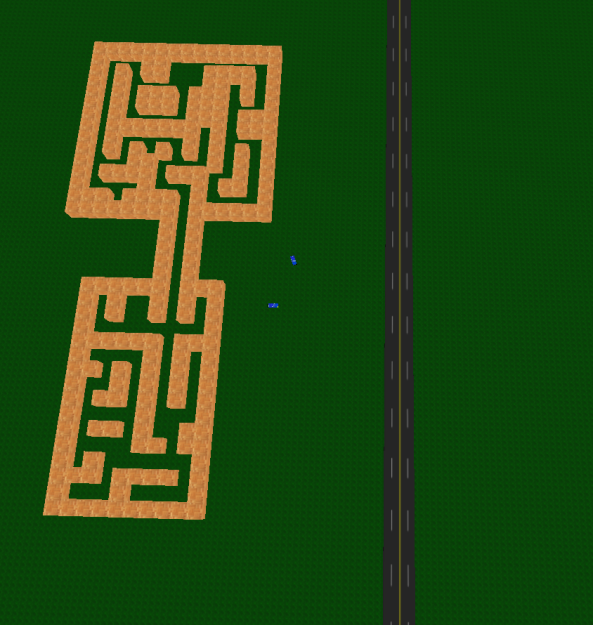
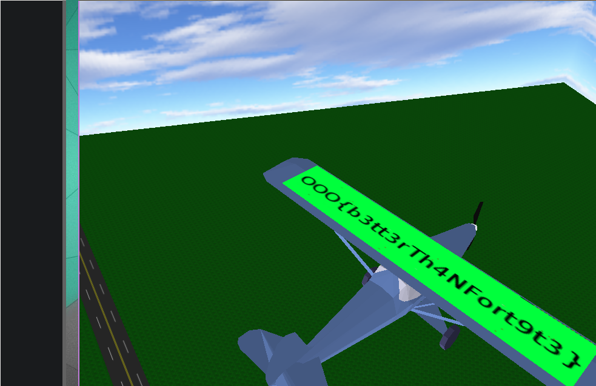

# BabyMaze (reverse, 122p, 53 solved)

> The flag is on the wings of the flying plane. It is possible to get the flag without instrumenting or modifying the binary. Tested on Ubuntu 16.04, Ubuntu 18.04, and Ubuntu 20.04. You should use a system able to run the game at approximately 60 fps. It requires: sudo apt-get install freeglut3

```shell
nc babymaze.challenges.ooo 7777
```

## Files:

- [BabyMaze](./files/BabyMaze) `4d7aabfb62d46ea98379254a62023f178c1922c0908f3ff19634ca8c22f97cef`

## Overview

This challenge is about a game binary communication with a classic TCP server. The game shows up a 3D game containing a maze which contains a computer, a yellow box and plane flying around over the maze.

To solve the challenge, we have to read the flag on the plane wings (flying required). Here are the steps required to get the flags:

- Walk to the computer
- Press `1` to trigger the 8-second countdown and spawn the second part of the maze after the computer
- Catch the yellow box in 8 seconds (which is impossible without cheating)
- Catching the yellow box activates a fly hack
- Fly on top of the plane to read the flag

As the description says, this challenge is not supposed to be "hacked" with any instrumentation techniques (gdb, memory hacking, etc). This first idea that comes in mind is that maybe a glitch is possible in the game.

However, we did not find any glitch allowing us to see the flags without "cheating". The expected solution was to go around the computer by spamming direction keys.

The maze looks as follows:



## Technical details

The main binary `BabyMaze` is spawning another binary downloaded from the Internet (`babymaze.challenges.ooo:7777`) through execve. There are a father and a son:

- The father is the original binary downloaded on the CTF platform
- The son is the other binary downloaded from the server containing all the game logics/graphics.

The important thing to note is that the parent is tracing the son, so weren't able to trace the son (graphic/logic part).

To cheat or to modify the behavior of the child, we’re gonna have to `LD_PRELOAD` our own `.so` into the game. However the following check is preventing us from doing so:

```c
  __nptr = *env;
  uVar4 = 0x0;
  while (__nptr != NULL) {
    if (((*__nptr == 'L') && (__nptr[0x1] == 'D')) && (__nptr[0x2] == '_')) {
      puts("Invalid environment");
      exit();
    }
    uVar4 = uVar4 + 0x1;
    __nptr = env[uVar4];
  }
```

As the father/son are both doing integrity checks, we were not able to patch the binary without having written "Cheater" on the plane wings.

We need to instrumentate the binary so that it is not exciting anymore. To do that, we should be able to use `gdb`. However, after finding the computer, the program crashes for some reason. Thanks to a friend, I found a way to do it stealthily.

We can use `pintool` with a custom trace module:

```c
#include <stdio.h>
#include "pin.H"

FILE * trace;

VOID printip(VOID *ip) {
  fprintf(trace, "%p\n", ip);
}

void jmp(ADDRINT ip, CONTEXT* ctxt)
{
    PIN_SetContextReg(ctxt, REG_INST_PTR, ip+0x1d); // Jump outside of the puts
    PIN_ExecuteAt(ctxt);
}

// Pin calls this function every time a new instruction is encountered
VOID Instruction(INS ins, VOID *v)
{
    // Insert a call to printip before every instruction, and pass it the IP
    if(((INS_Address(ins)&0xff0000000000) == 0x550000000000/* is it in .text ?*/) && ((INS_Address(ins)&0xfff)==0x0F0 /*There is two check, this is the first one*/|| ((INS_Address(ins)&0xfff) == 0x979 /* and the second one*/)))
    {
        INS_InsertCall(ins, IPOINT_BEFORE, (AFUNPTR)jmp, IARG_INST_PTR, IARG_CONTEXT, IARG_END);
    }
}

// This function is called when the application exits
VOID Fini(INT32 code, VOID *v)
{
    fclose(trace);
}

/* ===================================================================== */
/* Print Help Message                                                    */
/* ===================================================================== */

INT32 Usage()
{
    PIN_ERROR("This Pintool prints the IPs of every instruction executed\n"
              + KNOB_BASE::StringKnobSummary() + "\n");
    return -1;
}

/* ===================================================================== */
/* Main                                                                  */
/* ===================================================================== */

int main(int argc, char * argv[])
{
    trace = fopen("itrace.out", "w");

    // Initialize pin
    if (PIN_Init(argc, argv)) return Usage();

    // Register Instruction to be called to instrument instructions
    INS_AddInstrumentFunction(Instruction, 0);

    // Register Fini to be called when the application exits
    PIN_AddFiniFunction(Fini, 0);

    // Start the program, never returns
    PIN_StartProgram();

    return 0;
}

```

Compile this with pintool:

```shell
make -C  pin-3.13-98189-g60a6ef199-gcc-linux/source/tools/ManualExamples/
```

The load it in the binary:

```shell
LD_PRELOAD=./hook.so ./pin-3.13-98189-g60a6ef199-gcc-linux/pin -t ./pin-3.13-98189-g60a6ef199-gcc-linux/source/tools/ManualExamples/obj-intel64/itrace.so -- ./BabyMaze babymaze.challenges.ooo 7777
```

> To hook into this game, I used SwapBuffer function of the freeglut library. This function is called all the time so we can easily display stuff.

```c
void                    glutSwapBuffers(void)
{
  // Print something
  printf("Hooked!\n");

  // Call the good old one :)
  handle = dlopen("/usr/local/lib/libglut.so.3.9.0", RTLD_LAZY);
  old_swap = dlsym(handle, "glutSwapBuffers");
  old_swap();
}
```

The following two functions have been used to read/write the memory:

```c
int    read_memory(unsigned long addr, void *data, size_t size)
{
  int  fd = open("/proc/self/mem", O_RDONLY);

  lseek(fd, addr, SEEK_SET);
  int n = read(fd, data, size);

  close(fd);
  return n;
}

int     write_memory(unsigned long addr, void *data, size_t size)
{
  int   fd = open("/proc/self/mem", O_RDONLY | O_WRONLY );

  lseek(fd, addr, SEEK_SET);
  int n = write(fd, data, size);

  close(fd);
  return n;
}
```

To read the good data and find the player address, we simply reverse the son binary after dumping it through `/proc/:pid/exe`.

These two addresses contains ASLR addresses to interesting structure:

```c
# define PLAYER_BASE (0x00dc05f8) // Player ptr address
# define COORD_BASE (0x00dc0588) // Player coordinates base address
```

According to the binary, the player position can be retrieved like this:

```c
int                     read_int(unsigned long addr) {
  int                   value = 0;

  read_memory(addr, &value, sizeof(int));
  return value;
}


void                    write_pos(double x, double y, double z)
{
  unsigned long         position = read_int(COORD_BASE);

  write_memory(position+(22 * 8) + (8 * 0), &x, 8);
  write_memory(position+(22 * 8) + (8 * 1), &y, 8);
  write_memory(position+(22 * 8) + (8 * 2), &z, 8);
}

void                    read_pos(double *x, double *y, double *z)
{
  unsigned long         position = read_int(COORD_BASE);

  read_memory(position+(22 * 8) + (8 * 0), x, 8);
  read_memory(position+(22 * 8) + (8 * 1), y, 8);
  read_memory(position+(22 * 8) + (8 * 2), z, 8);
}
```

Also, writing, '3' or '2' at the following address allowed us to fly around:

```c
void                    fly()
{
  unsigned long long    a = 3;

  write_memory(0x00dc05c8, &a, sizeof(unsigned long long));
  printf("Let's fly !\n");
}
```

However, updating this field breaks the integrity checks and "Cheater" got written into the plane's wings. But this could be used to register player position to teleport fast enough :)

The binary is handling keyboard as follows:

```c
static player_t   *player;

void              keyboardHandler(char key)
{
  switch(key) {
  case 'A':
  case 'a':
    player->key = 0x61;
    break;
  default:
    if (key - 0x31U < 0x9) {
      player->key = key;
    }
    break;
  case 'D':
  case 'd':
    player->key = 0x64;
    break;
  case 'F':
  case 'f':
    player->key = 0x66;
    break;
  }
  // [...]
}
```

As the key is stored in memory, we can use that to write player position according to the positions we saved earlier. The final hook function will look as follows:

```c
void                    glutSwapBuffers(void)
{
  static void           *handle = NULL;
  static GLUTSWAP       old_swap = NULL;
  t_player              player;
  double                x, y, z;
  t_matrix              m1;


  printf("-----------------------------------\n");

  get_player(&player);
  get_matrix_at(COORD_BASE, &m1);


  // print_matrix(&m1);
  read_pos(&x, &y, &z);
  printf("x = %f; y = %f; z = %f;\n", x, y, z);


  // This allows us to toggle noclip/fly mode
  if (player.key == 0x61) {
    walk();
  }
  if (player.key == 0x64) {
    change_velocity(2.0);
    fly();
  }

  // If the 'f' key is pressed, teleport to the computer
  if (player.key == 0x66) { // f
    x = -48.002144; y = 3.189641; z = 88.500946;
  }


  // If the 'v' key is pressed, teleport to the yellow box
  // Once done, it will enable fly mode and we will be able to read the flag on the plane.
  if (player.key == 0x76) { // v
    x = 144.077972; y = 1.670742; z = 142.010620;
  }


  write_pos(x, y, z);

  set_player(&player);


  // Call the good old one :)
  handle = dlopen("/usr/local/lib/libglut.so.3.9.0", RTLD_LAZY);
  old_swap = dlsym(handle, "glutSwapBuffers");
  old_swap();
}
```

And we get the flag: `OOO{b3tt3rTh4nFort9t3}`



- SakiiR
