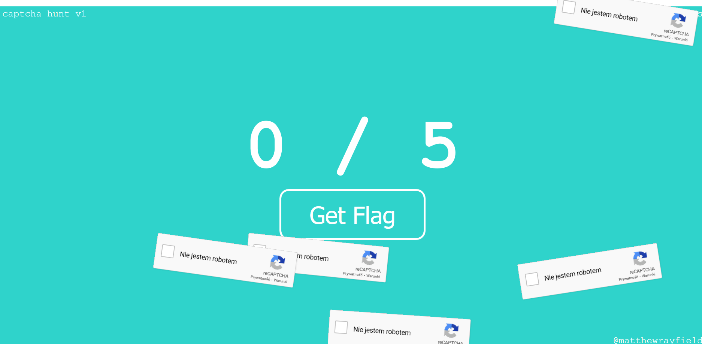

# Hunt (web, 50p, 577 solved)

In the task we get access to a simple webpage with 5 re-captcha boxes:



The goal is to check all of them and submit form to get the flag.
The issue is that those boxes are flying all over the screen...
The important bit of the page code is:

```js
function loop() {
    const height = window.innerHeight - captchaBox.offsetHeight;
    captchaBox.style.top = Math.sin(Date.now()/dividerA) * (height/2) + (height/2);

    const width = window.innerWidth - captchaBox.offsetWidth;
    captchaBox.style.left = Math.sin(Date.now()/dividerB) * (width/2) + (width/2);

    captchaBox.style.transform = `rotate(${Math.sin(Date.now()/dividerC) * 10}deg)`;

    setTimeout(loop, 1);
}
loop();
```

We can simply patch `setTimeout` function from the browser console to stop the movement:

```js
setTimeout = function(){}
```

And we get: `cybrics{Th0se_c4p7ch4s_c4n_hunter2_my_hunter2ing_hunter2}`
