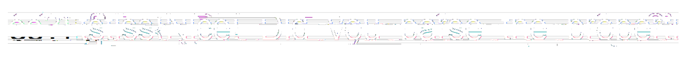

# 7-12 (stegano, 413p, 15 solved)

## Description

We start after solving `7-11` with input files recovered in the first stage.

## Files analysis

We have 376 archive parts to analyse.
If we simply peek into the archive, there are some junk binary files.

But if we again dive into hexeditor it looks more promising, first file:

```
7zĽŻ'...<č$çń.......#.......GkLÜ..[r‹§S.źÇAV$p{tŢ2PŰÔC’uŤ..ě_mK{.S"łĎMqµC˝
r.•7^F'ú’@Łkʱ%.bąč†SâöŃ..Hv.ł.oz§O*ŐÎ>ódĐ]Úőw7›řËB].ZµżŰ„..!„..îÂ.|@I.Š±K
ň>hťh.z.ěüÄTEýX"` ţ»IđĽwăA<sÜ\ě.®}xŠ&Ż.¸ĺŔ.M.¦!&Ç“.Ř.˘..ĆU.Ęz·WĐ$qúŁ.•ŻIô.
ÜT›C-¶1ţ2´PG¶„ĎÓĂáć.ä.0.*.0"„.Îdź2çnč-p…m.žÁ˘†Ł‰€Y.ÂóŤđ~Uí6sdG«Ôסo×.ČUz.=
úďő..ëÍŃŃ|L.Ů7ˇyä(I/6!#Rš—ÎhĐM!..ŰY˘gŮ^’^ú1¨ŕĹ„.TD.˛‹e3N™ş‰&âéCź22ř.H’’ĚVZ
ŞT¨«.ł.«ťü@˝€....3.®.Ő9ňi.$Óţłp..@.DçW{Ç(Lr4Čl.łÔ.đQK.čä "¦CO@—–?ËŁŢîO.˛řE
ś8Đg.L–şµó{j5çŔŔYŻ”Űŕ‡.¤.O.ăü.ď¤Ĺ.ZĄę.Őä.Á..0V®..=;%nł±'.™..Ž.ş(#..‰PNG..
......IHDR....`..€€......#....].....€Ö..i.,...
```

It starts with 7zip header, but what's that at the very end?
PNG header!

If we look into another file we can spot `sRGB` somewhere close to the end again.
And in another file there is `IHDR`.
In the last file, as expected, we find `IEND`.

It's pretty clear that there are PNG file chunks spread between our input archives.
We were not very familiar with 7zip format, but such tricks are nothing new in ZIP-like files. 
The headers contain offsets of "next chunk", so it's possibble to "skip" part of the file when ZIP is parsing it, and hide some data in such `no man's land`.
This seems to be the case here.

## 7zip format and `next header start`

There is very nice and comprehensive description of the format at https://py7zr.readthedocs.io/en/stable/archive_format.html

What we're interested in mostly is `Signature Header` and `Next Header Offset`.
Those are very easy to parse.

The next header offset tells us where is the next "real" part of ZIP, and our secret data are stored right before that.

The issue is that we don't really know where exactly they start!
After the signature header there might be some other ZIP related stuff and we need to skip those.

One could be crazy enough to write a proper parser for 7zip but who has time for this during a CTF?

### Use an existing library!

Our first attempt was to use the library `py7zr` which was providing the specification for us already.
This proved to be tricky, because the lib didn't seem to exponse the information we needed.
Fortunately a small `patch` solved this issue for us.
They have a very long method `_real_get_contents` and at the very end they do `self.fp.seek(self.afterheader)` to reset the file pointer position to start of the file, after parsing all the headers.
We simply added:

```python
self.magic_offset = self.fp.tell()
```

to save the position where the library finished parsing data.

```python
s7 = SevenZipFile(filepath)
offset = s7.magic_offset
```

This worked nicely for a lot of files, but for some reason not for all.
For some files the library did not recognize anything past the signature header, and claimed that `magic_offset` is 32 :(

### Forward heuristic

Why write a parser, when there has to be some simple heuristic to fix the remaining cases...
We looked at some of the leftover files, and also at the specs, and it seems that when some headers end there is always a nullbyte to indicate `END PropertyID`.

So let's do:

```python
real_offset = content[offset + 2:].index(b'\0') + offset + 3
```

This solved some more cases, but apparently some files had more header entries, and cutting at first nullbyte was not the right offset.

### Backward heuristic

Well, if we can't look forward, maybe we can look backward.
After all we know the `next header` offset, so we can look backwards from this position for the `END` nullbyte.

```python
real_offset = content[position - 40:position].index(b'\0') + position - 40 + 1
```

Notice `-40` here.
Instead of searching backwards from position, we noticed that all `proper` chunks are no more than 40 bytes long.
So we look forward from `next header -40`.
This is also to possibly avoid cases where the PNG actually had a nullbyte somewhere.

## Broken PNG

Sadly all this work did not provide us with the flag.
The [png](raw_out.png) is clearly a bit broken.
But it's not hopeless!
You can clearly see letters outlines and it seems that we're just missing/have too many bytes somewhere in the middle and everything just shifts.

We dive again into our trusty hexeditor and decide to just pad with nullbytes a bit in the middle, to try to shift the data a bit, and observe if perhaps we manage to get the right positions.

It doesn't work perfectly but we get (screenshoted, because not everything will show the broken PNG):



We got a bunch more similar images, with flag a bit shifted around, so we could try to decipher the letters.
It's was reasonably easy to get `Did_you_parse_the_properties?}` we know the prefix is `tstlss{` so we were missing just the first word of the flag.

This took a while to eyeball, but we finally realised it's `Nice!`, so the final flag was:

`tstlss{Nice!_Did_you_parse_the_properties?}`
