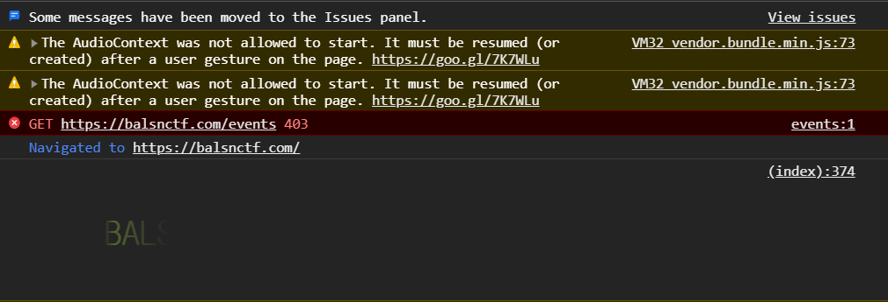

# Welcome2BalsnCTF (web, 110p, 483 solves)



We can see fading flag in developer tool.


The script that shows the flag is located at the bottom of https://balsnctf.com
```html
<script>
  console.log('%c ', atob('CgkgICAgYmFja2dyb3VuZC1pbWFnZTogdXJsKGRhdGE6aW1hZ2Uvc3ZnK3htbDtiYXNlNjQsQ2lBZ0lDQUpQSE4yWnlCMmFXVjNRbTk0UFNJd0lEQWdOVFV3SURNd0lpQjRiV3h1Y3owaWFIUjBjRG92TDNkM2R5NTNNeTV2Y21jdk1qQXdNQzl6ZG1jaUlIaHRiRzV6T25oc2FXNXJQU0pvZEhSd09pOHZkM2QzTG5jekxtOXlaeTh4T1RrNUwzaHNhVzVySWlCMlpYSnphVzl1UFNJeExqRWlQZ29KQ1FrOGRHVjRkQ0JtYjI1MExYTnBlbVU5SWpJMklpQm1iMjUwTFdaaGJXbHNlVDBpYlc5dWIzTndZV05sSWlCbWFXeHNQU2QxY213b0kzTndiM1JIY21Ga2FXNTBLU2NnZUQwbk1DY2dlVDBuTWpBblBnb0pDUWtKUWtGTVUwNTdhR1Z5WlY5cGMxOTViM1Z5WDNkbGJHTnZiV1ZmWm14aFozMEtDUWtKUEM5MFpYaDBQZ29KQ1FrOFpHVm1jejRLQ1FrSkNUeHNhVzVsWVhKSGNtRmthV1Z1ZENCcFpEMGljM0J2ZEVkeVlXUnBiblFpUGdvSkNRa0pDVHh6ZEc5d0lHOW1abk5sZEQwaU1DVWlJSE4wYjNBdFkyOXNiM0k5SWlOaU5XVTROVE1pSUhOMGIzQXRiM0JoWTJsMGVUMGlNQ0krQ2drSkNRa0pDVHhoYm1sdFlYUmxJR0YwZEhKcFluVjBaVTVoYldVOUltOW1abk5sZENJZ2RtRnNkV1Z6UFNJdU1Ec3VNRHN1TURzdU1Uc3VNanN1TXpzdU5Ec3VOVHN1TmpzdU56c3VPRHN1T1RzeElpQmtkWEk5SWpkeklpQnlaWEJsWVhSRGIzVnVkRDBpYVc1a1pXWnBibWwwWlNJZ0x6NEtDUWtKQ1FrOEwzTjBiM0ErQ2drSkNRa0pQSE4wYjNBZ2IyWm1jMlYwUFNJeU1DVWlJSE4wYjNBdFkyOXNiM0k5SWlOaU5XVTROVE1pSUhOMGIzQXRiM0JoWTJsMGVUMGlNU0krQ2drSkNRa0pDVHhoYm1sdFlYUmxJR0YwZEhKcFluVjBaVTVoYldVOUluTjBiM0F0YjNCaFkybDBlU0lnZG1Gc2RXVnpQU0l4T3pBN01Ec3hJaUJrZFhJOUlqTnpJaUJ5WlhCbFlYUkRiM1Z1ZEQwaWFXNWtaV1pwYm1sMFpTSWdMejRLQ1FrSkNRa0pQR0Z1YVcxaGRHVWdZWFIwY21saWRYUmxUbUZ0WlQwaWIyWm1jMlYwSWlCMllXeDFaWE05SWk0d095NHdPeTR4T3k0eU95NHpPeTQwT3k0MU95NDJPeTQzT3k0NE95NDVPekU3TVNJZ1pIVnlQU0kzY3lJZ2NtVndaV0YwUTI5MWJuUTlJbWx1WkdWbWFXNXBkR1VpSUM4K0Nna0pDUWtKUEM5emRHOXdQZ29nSUNBZ0lDQWdJQWtKQ1R4emRHOXdJRzltWm5ObGREMGlOREFsSWlCemRHOXdMV052Ykc5eVBTSWpZalZsT0RVeklpQnpkRzl3TFc5d1lXTnBkSGs5SWpBaVBnb2dJQ0FnSUNBZ0lBa0pDUWs4WVc1cGJXRjBaU0JoZEhSeWFXSjFkR1ZPWVcxbFBTSnZabVp6WlhRaUlIWmhiSFZsY3owaUxqQTdMakU3TGpJN0xqTTdMalE3TGpVN0xqWTdMamM3TGpnN0xqazdNVHN4T3pFaUlHUjFjajBpTjNNaUlISmxjR1ZoZEVOdmRXNTBQU0pwYm1SbFptbHVhWFJsSWlBdlBnb2dJQ0FnSUNBZ0lBa0pDVHd2YzNSdmNENEtDUWtKQ1R3dmJHbHVaV0Z5UjNKaFpHbGxiblErQ2drSkNUd3ZaR1ZtY3o0S0NRazhMM04yWno0S0NRaz0pOwoJICAgIHBhZGRpbmctbGVmdDogNjAwcHg7CgkgICAgZm9udC1zaXplOiAzMnB4OwoJICAgIG1hcmdpbjogMzBweDsKCSAgICBiYWNrZ3JvdW5kLXNpemU6IGNvbnRhaW47CgkgICAgYmFja2dyb3VuZC1wb3NpdGlvbjogMzBweCBjZW50ZXI7CgkgICAgYmFja2dyb3VuZC1yZXBlYXQ6IG5vLXJlcGVhdDsKICAgIA=='))
</script>
```

It contains the following CSS :
```css
background-image: url(data:image/svg+xml;base64,CiAgICAJPHN2ZyB2aWV3Qm94PSIwIDAgNTUwIDMwIiB4bWxucz0iaHR0cDovL3d3dy53My5vcmcvMjAwMC9zdmciIHhtbG5zOnhsaW5rPSJodHRwOi8vd3d3LnczLm9yZy8xOTk5L3hsaW5rIiB2ZXJzaW9uPSIxLjEiPgoJCQk8dGV4dCBmb250LXNpemU9IjI2IiBmb250LWZhbWlseT0ibW9ub3NwYWNlIiBmaWxsPSd1cmwoI3Nwb3RHcmFkaW50KScgeD0nMCcgeT0nMjAnPgoJCQkJQkFMU057aGVyZV9pc195b3VyX3dlbGNvbWVfZmxhZ30KCQkJPC90ZXh0PgoJCQk8ZGVmcz4KCQkJCTxsaW5lYXJHcmFkaWVudCBpZD0ic3BvdEdyYWRpbnQiPgoJCQkJCTxzdG9wIG9mZnNldD0iMCUiIHN0b3AtY29sb3I9IiNiNWU4NTMiIHN0b3Atb3BhY2l0eT0iMCI+CgkJCQkJCTxhbmltYXRlIGF0dHJpYnV0ZU5hbWU9Im9mZnNldCIgdmFsdWVzPSIuMDsuMDsuMDsuMTsuMjsuMzsuNDsuNTsuNjsuNzsuODsuOTsxIiBkdXI9IjdzIiByZXBlYXRDb3VudD0iaW5kZWZpbml0ZSIgLz4KCQkJCQk8L3N0b3A+CgkJCQkJPHN0b3Agb2Zmc2V0PSIyMCUiIHN0b3AtY29sb3I9IiNiNWU4NTMiIHN0b3Atb3BhY2l0eT0iMSI+CgkJCQkJCTxhbmltYXRlIGF0dHJpYnV0ZU5hbWU9InN0b3Atb3BhY2l0eSIgdmFsdWVzPSIxOzA7MDsxIiBkdXI9IjNzIiByZXBlYXRDb3VudD0iaW5kZWZpbml0ZSIgLz4KCQkJCQkJPGFuaW1hdGUgYXR0cmlidXRlTmFtZT0ib2Zmc2V0IiB2YWx1ZXM9Ii4wOy4wOy4xOy4yOy4zOy40Oy41Oy42Oy43Oy44Oy45OzE7MSIgZHVyPSI3cyIgcmVwZWF0Q291bnQ9ImluZGVmaW5pdGUiIC8+CgkJCQkJPC9zdG9wPgogICAgICAgIAkJCTxzdG9wIG9mZnNldD0iNDAlIiBzdG9wLWNvbG9yPSIjYjVlODUzIiBzdG9wLW9wYWNpdHk9IjAiPgogICAgICAgIAkJCQk8YW5pbWF0ZSBhdHRyaWJ1dGVOYW1lPSJvZmZzZXQiIHZhbHVlcz0iLjA7LjE7LjI7LjM7LjQ7LjU7LjY7Ljc7Ljg7Ljk7MTsxOzEiIGR1cj0iN3MiIHJlcGVhdENvdW50PSJpbmRlZmluaXRlIiAvPgogICAgICAgIAkJCTwvc3RvcD4KCQkJCTwvbGluZWFyR3JhZGllbnQ+CgkJCTwvZGVmcz4KCQk8L3N2Zz4KCQk=);
padding-left: 600px;
font-size: 32px;
margin: 30px;
background-size: contain;
background-position: 30px center;
background-repeat: no-repeat;
```

Which, in turn, decodes to the following base64 :
```xml
<svg viewBox="0 0 550 30" xmlns="http://www.w3.org/2000/svg" xmlns:xlink="http://www.w3.org/1999/xlink" version="1.1">
    <text font-size="26" font-family="monospace" fill='url(#spotGradint)' x='0' y='20'>
        BALSN{here_is_your_welcome_flag}
    </text>
    <defs>
        <linearGradient id="spotGradint">
            <stop offset="0%" stop-color="#b5e853" stop-opacity="0">
                <animate attributeName="offset" values=".0;.0;.0;.1;.2;.3;.4;.5;.6;.7;.8;.9;1" dur="7s" repeatCount="indefinite" />
            </stop>
            <stop offset="20%" stop-color="#b5e853" stop-opacity="1">
                <animate attributeName="stop-opacity" values="1;0;0;1" dur="3s" repeatCount="indefinite" />
                <animate attributeName="offset" values=".0;.0;.1;.2;.3;.4;.5;.6;.7;.8;.9;1;1" dur="7s" repeatCount="indefinite" />
            </stop>
            <stop offset="40%" stop-color="#b5e853" stop-opacity="0">
                <animate attributeName="offset" values=".0;.1;.2;.3;.4;.5;.6;.7;.8;.9;1;1;1" dur="7s" repeatCount="indefinite" />
            </stop>
        </linearGradient>
    </defs>
</svg>
```