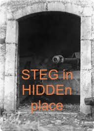

# Stug reference (Stegano, 50p, 136 solved)

## Description

```
Do you have your own stug pass hidden within?

Flag format: ctf{sha256}
```

In the task we get an image:



## Task analysis

It's clear that task hints at using `steghide`.

## Solution

We run:

```
steghide.exe --extract -sf stug.jpg
```

And guess the password to be `stug` and get: `ctf{32849dd9d7e7b313c214a7b1d004b776b4af0cedd9730e6ca05ef725a18e38e1}`
