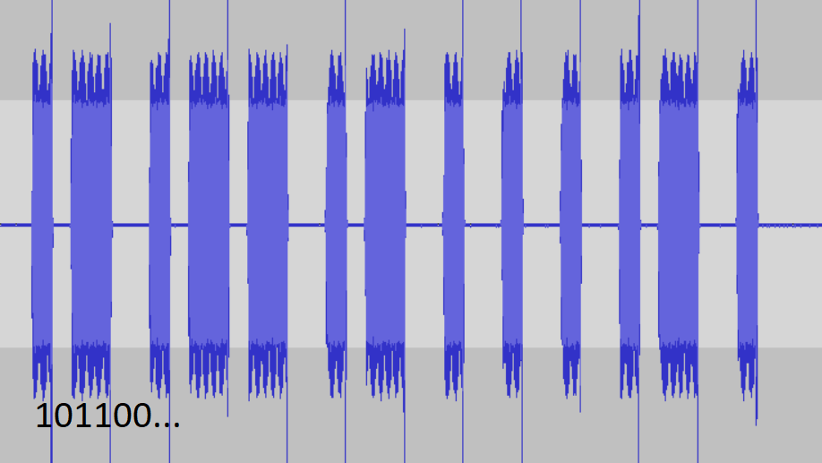

# RF is spOOKy (misc, 996p, 21 solved)

## Description

```
ACME corp has contracted you to figure out how to demodulate a secret RF signal recorded with an rtl-sdr. They have recorded many identical bursts, but your job is to demodulate one of them.
Flag format: utflag{DEMODULATED_BITSTREAM} where DEMODULATED_BITSTREAM is the actual 37 bits that were transferred over the air. file format: sample rate = 180000hz , sample type = unsigned 8-bit
```

We get [some data](off.iq)


## Task analysis

It's pretty clear that we have some kind of radio transmission, and it seems there is some secret bit pattern sent multiple times.
Our goal is to demodulate the data and recover the bitstream.

## Solution

We initially tried loading this into GNU Radio, but we realised we have absolutely no idea how to use it...
So it's Audacity time!

Once we load this as raw data and set the bitrate we can play this as audio.
It's clear that in the middle there is a bunch of beeps.
We assume that those beeps are the `bursts` with secret bits.

Once we zoom-in on them we can see a clear regular pattern.
What is more interesting is that if we cut this into pieces of similar length, we get... 37.



We can just type the bits and submit `utflag{1011001011011001011001001001001011001}`
