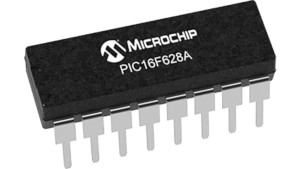
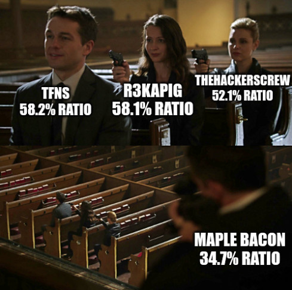

# Picoify - UIUCTF 2024 (misc, 10 solves, custom scoring)

## Introduction

Picoify is a programming challenge where players compete against the most optimal
compression algorithm given some constraints:

  - the compression code must run on a Microchip PIC16F628A, communicating over
    serial port,
  - the decompression code must run in Python in less than 3 seconds,
  - the data to compress is 2048 bytes of ASCII UPPERCASE text with some
    leetspeak in it,
  - the compression must be lossless.

The scoring function is affine, going from 500 points for the best submitted
compression to 100 points for the worst submitted compression.
The remote solver refuses algorithms that have a compression ratio worse than
75%, i.e. that reduces the data to at most 75% of its original size.

Attached with the challenge description, we find a sample PIC16 assembly code
`sample.S` and the sources of the checker Docker image.



## Generating a dataset

Before writing a compression algorithm, we need a better understanding of the
type of data we need to compress. Let's generate some input data to see what we
are dealing with.

The input data is produced by the `generate_data` function inside `chal.py`.
This function randomly chooses UPPERCASE ASCII words in the first 8191 words of
`words.txt` file.
It then randomly transforms some characters (A, B, E, G, I, O, S, T or Z) into
their [leetspeak](https://en.wikipedia.org/wiki/Leet) equivalent.
Finally, it joins all the chosen words with spaces and keep only the first 2048
characters.

Let's reuse this function to generate a 160 KiB dataset:
```python
# 0x1fff=8191 words, 20 samples for each word
data = generate_data(8191*20)
with open("examples.txt", "wb") as f:
    f.write(data)
```

Running this script generates sequence of words in `examples.txt`:
```
IR L3GI71M4T3 NEWCASTLE VA7 PR123 SUPPLY PR0DUCT1V3 84N6K0K WIR3 AR6UMENT [...]
```

## Choosing an algorithm

The Microchip PIC16F628A has only 224 bytes of SRAM. This means that we can't
store the whole input in memory. **We need a streaming compression algorithm.**

Looking at `exemples.txt`, we can make some observations.
There are **only 32 different ASCII characters**.

Calling `gzip` on the first 2048 bytes of `examples.txt` reveals that
**[Gzip](https://en.wikipedia.org/wiki/Gzip) manages a compression ratio of
61.52% on this type of data**.
As Gzip is a compression algorithm that is not specifically tailored to our type of data, we should expect to manage a lower compression ratio.

As there seems to be weak dependence between consecutive input characters, an
algorithm like [Lempel–Ziv–Storer–Szymanski (LZSS)](https://en.wikipedia.org/wiki/Lempel%E2%80%93Ziv%E2%80%93Storer%E2%80%93Szymanski) might perform poorly.

**First algorithm idea.**
The longest word is 19 characters. A word has at most 12 characters in it that could be
transformed into leetspeak. We could implement this custom compression algorithm:
 1. revert the leetspeak operation and use 1 bit to indicate leetspeak,
 2. compress the UPPERCASE ASCII representation down to 5-bit per char,
 3. pack all 1+5 bits symbols together.

This technique makes us gain 2 bits per character, which means a 75% compression
ratio, i.e. the minimum to be accepted by the online checker. We can surely do
better!


**Second algorithm idea.**
Words are randomly chosen with a uniform distribution. There is no dependency
between words. We could encode each word with 2 bytes + 12 bits for leetspeak
position.
As there are ~280 words in a 2048 bytes input, this technique could manage a 47.85%
compression ratio. Good!
However, there are 8191 words, and the PIC16F628A only has 2048 bytes of flash
memory. So this is not feasible due to memory constraints.

**Final algorithm idea.**
The input is a sequence of characters that doesn't follow a uniform
distribution: there is likely to be much more spaces characters than `A`
characters. We can use this property to encode most likely characters with fewer
bits. **We use [Huffman coding algorithm](https://en.wikipedia.org/wiki/Huffman_coding)
to encode each character.**

Note that Huffman coding is optimal if there is no dependency between input
characters. In our case, characters are not independent, so we will not reach
optimal compression.

## Huffman tree precomputation

As we want streaming compression and have limited resources, we can't compute
the Huffman tree directly on the PIC16. We need to precompute the most likely
frequencies, build the tree, and then **hardcode a Huffman table in the firmware**.

Let's use our `examples.txt` dataset to compute frequencies:
```python
import collections

data = bytearray()
with open("examples.txt", "rb") as f:
    for c in f.read():
        if c == 32:
            c = 91
        if c < 65:
            c += 44
        c += -65
        data.append(c)

counter = collections.Counter(data)
print(", ".join(str(counter[c]) for c in sorted(counter.keys())))
# outputs: 6912, 1396, 7900, 6671, 10044, 2401, 2166, 3685, 7099, 435, 1469, 8575, 5021, 12686, 5502, 5183, 300, 12506, 6510, 6303, 4998, 2257, 1675, 618, 2670, 151, 26243, 5555, 7118, 172, 10133, 6899, 6647, 2198, 6332, 1450
```

We find [a simple Huffman implementation in C](https://github.com/DanielScocco/Simple-Huffman-Coding/blob/307c20b7629de155063b5c54c16b9e55f0c858e0/huffman.c) online.
By patching `englishLetterFrequencies` and removing some code for space character (32), we get
`codeTable2`:

```C
int codeTable2[36] = {
    21211, 2211212, 21111, 22211, 1222, 212122, 1112111, 212111, 11211, 212112111, 2111212, 11111, 22122, 2221, 12212, 22212, 222112111, 2112, 21221, 21112, 12222, 122222, 1111212, 112112111, 112122, 2122112111, 121, 21212, 22111, 1122112111, 1122, 12211, 11221, 222222, 11112, 1211212
}
```

This representation is not really friendly for our PIC16. Let's store the length
in a separate table and use base 2:
```C
unsigned char huffman_table[] = {
    20, 101, 16, 28, 7, 43, 8, 40, 4, 72, 69, 0, 27, 14, 13, 29, 200, 9, 22, 17, 15, 31, 5, 72, 11, 200, 2, 21, 24, 200, 3, 12, 6, 63, 1, 37
};
unsigned char huffman_table_len[] = {
    5, 7,  5, 5, 4, 6, 7, 6, 5, 9, 7, 5, 5, 4, 5, 5, 9, 4, 5, 5, 5, 6, 7, 9, 6, 10, 3, 5, 5, 10, 4, 5, 5, 6, 5, 7
};

// [...] when accessible the table, c is our input character
    if (c == 32)
      c = 91;
    if (c < 65)
      c += 44;
    c -= 65;

    length = huffman_table_len[c];
    n = huffman_table[c];
    if (c == 9 || c == 16)
      n += 256;
    if (c == 25)
      n += 512;
```

This code use only 2 tables of 36 bytes to store the Huffman table, great!

## PIC16 compression code

As we don't want to deal with debugging PIC16 assembly code, we use the provided
`sample.S` to write an equivalent boilerplate in `C`.

```C
#include <xc.h>

unsigned char huffman_table[] = {
    20, 101, 16, 28, 7, 43, 8, 40, 4, 72, 69, 0, 27, 14, 13, 29, 200, 9, 22, 17, 15, 31, 5, 72, 11, 200, 2, 21, 24, 200, 3, 12, 6, 63, 1, 37
};
unsigned char huffman_table_len[] = {
    5, 7,  5, 5, 4, 6, 7, 6, 5, 9, 7, 5, 5, 4, 5, 5, 9, 4, 5, 5, 5, 6, 7, 9, 6, 10, 3, 5, 5, 10, 4, 5, 5, 6, 5, 7
};

int remaining;
char buf;

void interrupt int_rx_handler() {
  // read the received byte
  buf = RCREG;

  // clear the interrupt flag
  RCIF = 0;
}

void init_tx(void) {
  // RB1/RX/DT and RB2/TX/CK pins as inputs
  TRISB1 = 1;
  TRISB2 = 1;

  // 9600 baud rate at 20MHz clock
  SPBRG = 32;

  // Enable the asynchronous serial port by clearing bit SYNC and setting bit SPEN.
  SYNC = 0;
  SPEN = 1;

  // Enable the transmission by setting bit TXEN, which will also set bit TXIF.
  TXEN = 1;
}

void init_rx(void) {
  // If interrupts are desired, then set enable bit RCIE.
  RCIE = 1;

  // Enable the reception by setting bit CREN.
  CREN = 1;
}

void send_byte(char data) {
  while (!TRMT)
    ;
  TXREG = data;
}

int main(void) {
  char c;
  char x;
  char bitsLeft;
  char bit_n;
  char length;
  int n;
  int i;

  // enable interrupts
  GIE = 1;
  PEIE = 1;

  remaining = 2048;
  buf = 0;

  x = 0;
  bitsLeft = 8;
  i = 0;

  init_tx();
  init_rx();

  do {
    // Wait for new character
    while (buf == 0)
      ;
    c = buf;
    buf = 0;
    remaining--;

    // Map characters to [0, 36[
    if (c == 32)
      c = 91;
    if (c < 65)
      c += 44;
    c -= 65;

    // Get length and n from hardcoded Huffman tables
    length = huffman_table_len[c];
    n = huffman_table[c];
    if (c == 9 || c == 16 || c == 25)
      n += 256;
    if (c == 25)
      n += 256;

    // Huffman algo
    while (length > 0) {
      bit_n = n % 2;
      n >>= 1;
      x = x | bit_n;
      bitsLeft -= 1;
      length -= 1;
      if (bitsLeft == 0) {
        send_byte(x);
        x = 0;
        bitsLeft = 8;
      }
      x = x << 1;
    }

    i++;

    // Pat the watchdog
    CLRWDT();
  } while (remaining > 0);

  // Add remaining bits
  if (bitsLeft != 8) {
    x = x << (bitsLeft - 1);
    send_byte(x);
  }

  while (1) {
    // Pat the watchdog
    CLRWDT();
  }

  return 0;
}
```

We compile the previous code using the [MPLAB XC8 Compiler](https://www.microchip.com/en-us/tools-resources/develop/mplab-xc-compilers).
```
$ xc8 --chip=16F628A ./pic.c
/path/to/xc8/v2.46/pic/bin/picc @/tmp/xcXDIocfN/xc8_tmp_0.cmd [ --chip=16F628A ./pic.c ]
Microchip MPLAB XC8 C Compiler V2.46
Build date: Jan  4 2024
Part Support Version: 2.46
Copyright (C) 2024 Microchip Technology Inc.
License type: Could not start dynamically linked executable: /home/erdnaxe/ctf/uiu/xc8/v2.46/b
legacy HI-TECH support is deprecated and will be discontinued in a future release; consult the release notes for more details
legacy C90 library is deprecated and will be discontinued in a future release; consult the release notes for more details

Memory Summary:
    Program space        used   121h (   289) of   800h words   ( 14.1%)
    Data space           used    13h (    19) of    E0h bytes   (  8.5%)
    EEPROM space         used     0h (     0) of    80h bytes   (  0.0%)
    Configuration bits   used     0h (     0) of     1h word    (  0.0%)
    ID Location space    used     0h (     0) of     4h bytes   (  0.0%)

```

14.1% program space usage!

## Python decompression code

Here I was lazy and just rewrote `decompressFile` from [this Huffman implementation](https://github.com/DanielScocco/Simple-Huffman-Coding/blob/307c20b7629de155063b5c54c16b9e55f0c858e0/huffman.c) found online.
This code is not optimized, but it is enough to flag.

```Python
#!/usr/bin/env python3

freq = [6912, 1396, 7900, 6671, 10044, 2401, 2166, 3685, 7099, 435, 1469, 8575, 5021, 12686, 5502, 5183, 300, 12506, 6510, 6303, 4998, 2257, 1675, 618, 2670, 151, 26243, 5555, 7118, 172, 10133, 6899, 6647, 2198, 6332, 1450]

class Node:
    def __init__(self, value, letter, left, right):
        self.value = value
        self.letter = letter
        self.left = left
        self.right = right


def findSmaller(array: [Node], differentFrom: int) -> int:
    i = 0
    while array[i].value == -1:
        i += 1
    smaller = i
    if i == differentFrom:
        i += 1
        while array[i].value == -1:
            i += 1
        smaller = i
    for i in range(36):
        if array[i].value == -1:
            continue
        if i == differentFrom:
            continue
        if array[i].value < array[smaller].value:
            smaller = i
    return smaller


def buildT() -> Node:
    array = [Node(freq[i], i, None, None) for i in range(36)]
    subTrees = 36
    while subTrees > 1:
        smallOne = findSmaller(array, -1)
        smallTwo = findSmaller(array, smallOne)
        temp = array[smallOne]
        array[smallOne] = Node(temp.value + array[smallTwo].value, 127, array[smallTwo], temp)
        array[smallTwo].value = -1
        subTrees -= 1
    return array[smallOne]


t = buildT()
cur = t
mask = 1 << 7
j = 0
for c in data:
    for i in range(8):
        bit = c & mask
        c = c << 1
        if bit == 0:
            cur = cur.left
            if cur.letter != 127:
                char = cur.letter + 65
                if char == 91:
                    char = 32
                if char > 91:
                    char -= 44
                out[j] = char
                j += 1
                cur = t
        else:
            cur = cur.right
            if cur.letter != 127:
                char = cur.letter + 65
                if char == 91:
                    char = 32
                if char > 91:
                    char -= 44
                out[j] = char
                j += 1
                cur = t
print(out[:2048].decode(), end="")
```

Voilà! Now we base64 the codes and submit to the server:
```
base64 pic.hex -w 0
base64 decompress.py -w 0
```

After some runs, we got a score of 856, i.e. 58.2% compression ratio!

```
Flags returned by the remote:
7011c383a47784146a6a2be493bc4c265d80f034056bad8c65e8ea587cc0db0d.848
99ed0480d675e02efbc43a1bcabfd8994e30779a2b9ccf1a1e74747745b28aff.849
7c54621f2af9c9977a730218190038c1df632b971e707032f3497abced37abf9.851
7fade1fdac7b73518ae27c0949cbf7546fb6a4ff167c731d5d28e2cc43d8403e.852
b604e14eb0d8978085fac318e44e9aa85ef1384b8367b0d553ac1e237a6bfcec.856 <- BEST
```

This was enough to get us to the top 4 on Picoify:
```
           Team           |     Score       |           Time
--------------------------+-----------------+----------------------------
 Maple Bacon              | {"score": 1337} | 2024-06-30 19:24:57.567+00
 thehackerscrew           | {"score": 980}  | 2024-06-30 19:49:18.4+00
 r3kapig                  | {"score": 859}  | 2024-06-30 13:29:04.553+00
 The Flat Network Society | {"score": 856}  | 2024-06-29 17:17:16.553+00
 Team Austria             | {"score": 850}  | 2024-06-29 19:03:02.087+00
 Perperikon               | {"score": 843}  | 2024-06-29 19:59:56.281+00
 Brunnerne                | {"score": 837}  | 2024-06-30 12:09:16.699+00
 Kalmarunionen            | {"score": 649}  | 2024-06-30 15:04:40.344+00
 pwnlentoni               | {"score": 603}  | 2024-06-30 10:46:12.362+00
 gsitcia                  | {"score": 512}  | 2024-06-30 01:46:13.402+00
(10 rows)
```



## Conclusion

We managed to code a Huffman compression algorithm for PIC16 using 289 bytes of
flash memory and 19 bytes of SRAM.

**How could we do better?**
There is still lots of unused memory space, we could use it to improve compression.
Our algorithm does not use the dependence between characters.
We could maybe improve our score by coding tokens of multiple characters.
For example, `PR0DUCT1V3 ` could be split into `PR0`, `DU`, `CT1`, `V3`
and ` `, then encoded with Huffman algorithm.
