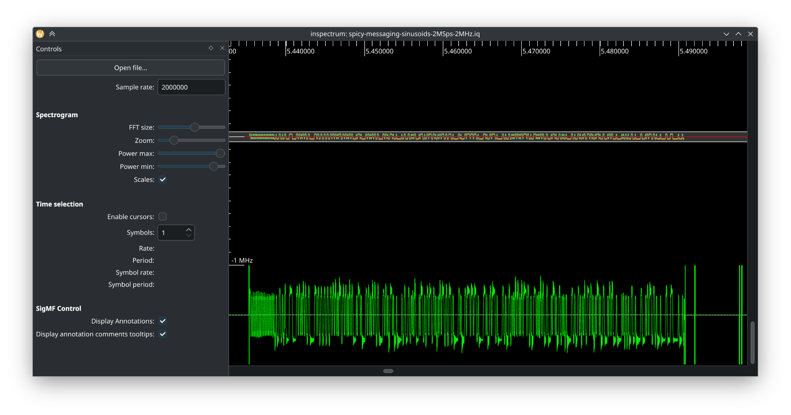
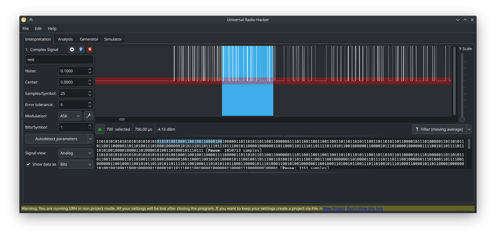
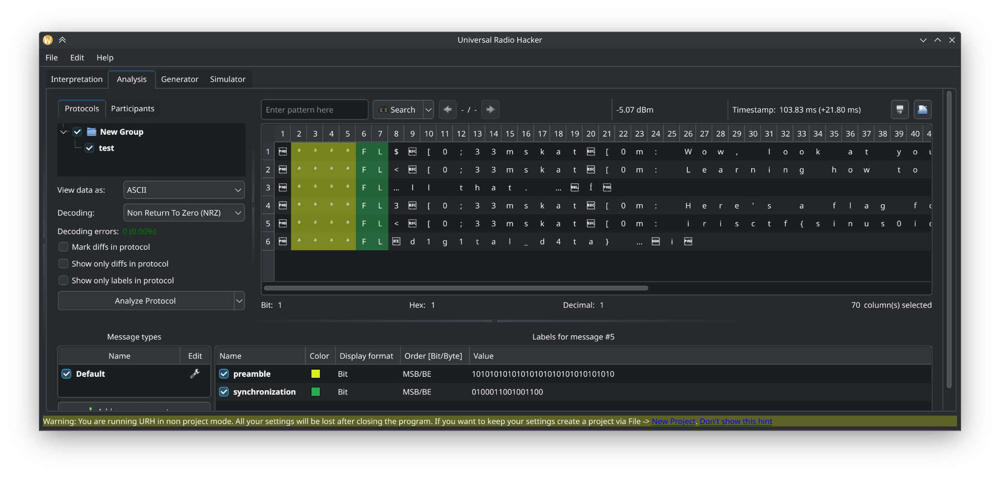

# Spicy Messaging Sinusoids - IrisCTF 2025 (radio, 2 solves, 500p)

> All the kids are using this Spicy Messaging Sinusoids thing nowadays. Nobody speaks to each other anymore!
>
> Medium challenge, by skat.

Attached, we find an archive `spicy-messaging-sinusoids.tar.gz`.

## Initial analysis: dat to iq conversion

The archive contains only one file: `spicy-messaging-sinusoids-2MSps-2MHz.dat`.

This file ends with `.dat`, not `.iq`, so we need to guess the representation used here.
Here is an extract of a hexdump of this file:
```
[...]
00490320  00 00 00 00 00 00 00 00  00 00 06 fd 07 ff 08 ff  |................|
00490330  08 ff 08 ff 08 ff 08 ff  08 ff 08 ff 08 fe 07 fe  |................|
00490340  08 fe 08 fe 08 fe 07 fe  07 fe 08 fe 07 fe 07 fe  |................|
00490350  07 fe 07 fe 07 fe 07 fe  07 fe 08 ff 07 ff 08 fe  |................|
00490360  07 ff 07 fe 07 fe 07 fe  07 fe 07 fe 07 fe 07 fe  |................|
00490370  07 fe 07 fe 07 fe 07 fd  07 fe 07 fe 07 fe 07 fe  |................|
[...]
```
Radio signal should be mostly continuous and each sample may be represented by a real and an imaginery number.
By looking closely, we can notice two continous series interleaved:

  - `06 07 08 08 08 08 08 08 08 08 07...`
  - `fd ff ff ff ff ff ff ff ff fe fe...`

This means we have two signed bytes (real + imaginary) for each sample.

Let's write a Python script to convert this signal to IQ (complex64):
```python
import numpy as np

x = np.fromfile("spicy-messaging-sinusoids-2MSps-2MHz.dat", dtype=np.int8).astype(np.complex64)
x = x[::2] + x[1::2]*1j
x.tofile("spicy-messaging-sinusoids-2MSps-2MHz.iq")
```

We now have `spicy-messaging-sinusoids-2MSps-2MHz.iq` ready to be analyzed.

## Initial analysis: Inspectrum

The challenge hints towards text messages (SMS in the name).
By loading the IQ file in Inspectrum, setting a 2MSample/s rate and setting power, we notice some patterns in the signal.
Let's add a derived frequency plot (right-click on the signal) and then export samples to `signal.f32`.



## Message extraction using Universal Radio Hacker

By opening `signal.f32` in Universal Radio Hacker, the software automatically detects demodulation parameters.
We tweak a bit the parameters until the demodulation looks nice:

  - Noise: 0.1
  - Center: 0
  - Samples/Symbol: 25



From the demodulation we already see some patterns such as alternating 010101 for clock synchronisation.

We now go to "Analysis" tab and click "Analyse Protocol".
URH automatically finds the following parameters:

  - Preambule: `10101010101010101010101010101010`
  - Sync: `0100011001001100`

By changing the view to ASCII, we see the following flag:
```
irisctf{sinus0ids_transm1tting_un3ncrypted_d1g1tal_d4ta}
```


